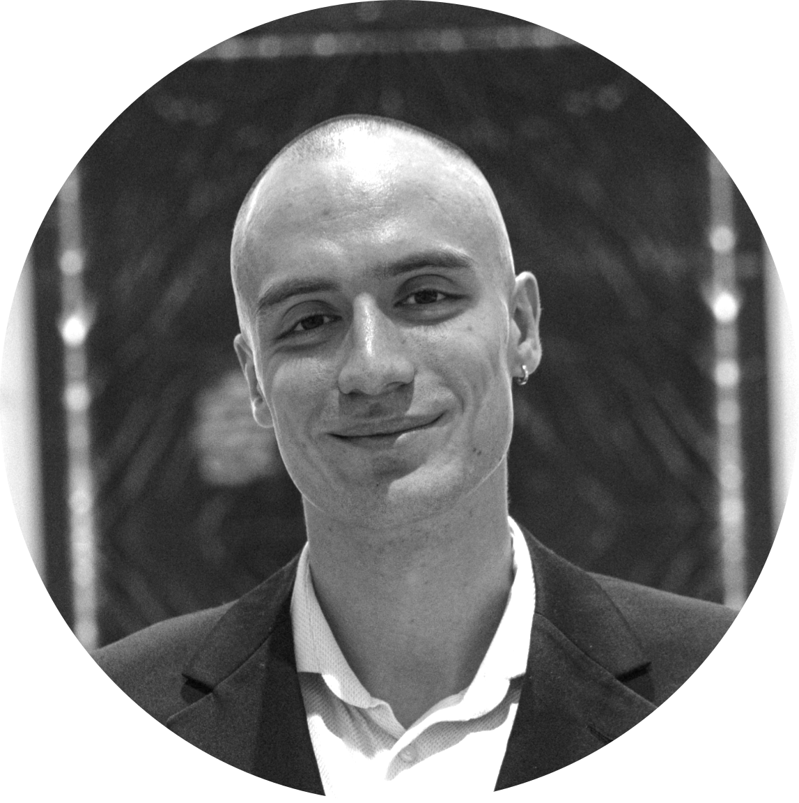

# Authors

`regelum` is developed by researchers and engineers working on reinforcement
learning, control, and dynamical systems.

{ align=left width="25%" }

## Georgiy Malaniya

Georgiy Malaniya received a specialist degree from the Faculty of Mechanics
and Mathematics of Moscow State University in 2021. His research mainly
focuses on control theory and machine learning. Georgiy has industrial
experience in R&D at Huawei Tech as a research engineer in the field of
machine learning from 2019 to 2021, developing time-series models based on
Bayesian methods.

In 2021, Georgiy joined the Artificial Intelligence in Dynamic Action
laboratory at Skoltech as a postgraduate researcher. His main area of research
is reinforcement learning with safety guarantees.

---

{ align=left width="25%" }

## Anton Bolychev

Anton Bolychev received a diploma with honors from Moscow State University in
2020. In the industrial sector, Anton contributed to quantitative research at
VTB Capital by developing infrastructure for pricing financial instruments and
conducted machine learning and deep learning research at Kamaz.

Since 2022, Anton has been a PhD student and a member of the AIDA lab at
Skoltech. He is focused on practical applications in reinforcement learning
and optimal control.

---

{ align=left width="25%" }

## Pavel Osinenko

Pavel Osinenko received a diploma with honors from Bauman Moscow State
Technical University in 2009 and a PhD degree from Dresden University of
Technology in 2014. From 2011 through 2020, Pavel worked in German academic
and industrial sectors as a principal engineer and researcher.

Since 2020, Pavel has been an assistant professor at Skoltech in Moscow. His
profile is focused on reinforcement learning, nonlinear control, and
computational aspects of dynamical systems.
