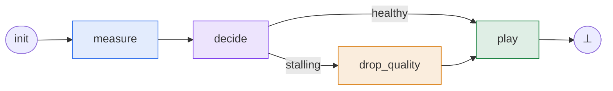
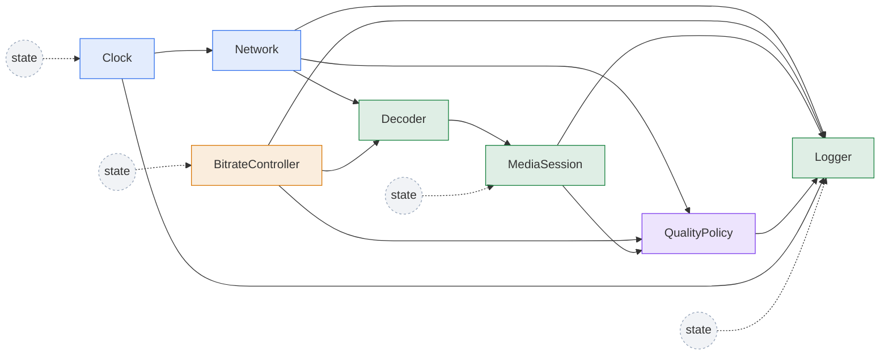

# Create, Compile, and Run a Phased Reactive System

## Recap

By this point the video player has three layers of declarations:

- node instances such as `Clock`, `Network`, `QualityPolicy`, and
  `MediaSession`;
- phases such as `measure`, `decide`, `drop_quality`, and `play`;
- transitions that say how one phase hands control to the next.

!!! example "The running example: an adaptive-bitrate video player"

    The player samples network bandwidth, decides whether the current bitrate
    is sustainable, optionally lowers quality, and then plays the next chunk.
    The buffer and bitrate persist across ticks, so the next tick starts from
    the state left by the previous one.



| Phase | Nodes | What happens |
|---|---|---|
| <span class="phase-label phase-label--measure">measure</span> | `Clock`, `Network` | Advance the tick counter; sample the current bandwidth. |
| <span class="phase-label phase-label--decide">decide</span> | `QualityPolicy` | Compare projected drain rate against the buffer; set `stalling`. |
| <span class="phase-label phase-label--drop-quality">drop_quality</span> | `BitrateController` | Drop the target bitrate by one rung. |
| <span class="phase-label phase-label--play">play</span> | `Decoder`, `MediaSession`, `Logger` | Compute downloaded seconds, integrate the buffer, log. |

At node level, the same model looks like this.
Solid arrows show that one node reads another node's output; dashed
arrows from `state` show self-reads, where a node reads its own output from
the previous tick.
The node colors correspond to the phase colors in the table above:



??? example "Full code listing: `examples/video_player.py`"

    ```python
    --8<-- "examples/video_player.py"
    ```

Those declarations are still just Python objects.
To make them executable, wrap the phase list in `rg.PhasedReactiveSystem`.
System creation compiles the declarations into a concrete runtime model:
references are resolved, nodes are scheduled, transition targets are checked,
and the initial-state requirements are computed.

```python
import regelum as rg


def build_system() -> rg.PhasedReactiveSystem:
    clock = Clock()
    network = Network()
    policy = QualityPolicy()
    controller = BitrateController()
    decoder = Decoder()
    session = MediaSession()
    logger = Logger()

    return rg.PhasedReactiveSystem(
        phases=[
            rg.Phase(
                "measure",
                nodes=(clock, network),
                transitions=(rg.Goto("decide"),),
                is_initial=True,
            ),
            rg.Phase(
                "decide",
                nodes=(policy,),
                transitions=(
                    rg.If(
                        rg.V(policy.Outputs.stalling),
                        "drop_quality",
                        name="stalling",
                    ),
                    rg.Else("play", name="healthy"),
                ),
            ),
            rg.Phase(
                "drop_quality",
                nodes=(controller,),
                transitions=(rg.Goto("play"),),
            ),
            rg.Phase(
                "play",
                nodes=(decoder, session, logger),
                transitions=(rg.Goto(rg.terminate),),
            ),
        ],
    )
```

`rg.PhasedReactiveSystem` is the object you keep and run.
It owns the compiled phase graph, the current runtime state, and the compile
report.

## Creating a system

The constructor receives the phases that define the system.

```python
system = rg.PhasedReactiveSystem(phases=phases)
```

During construction, `regelum` compiles the system.
If compilation succeeds, the returned object is ready for `step()`, `run()`,
`snapshot()`, `read(...)`, and `reset(...)`.
If compilation fails, the default behavior is to raise `CompileError`.

Use `strict=False` when you want to inspect a broken system instead of raising
immediately:

```python
system = rg.PhasedReactiveSystem(
    phases=phases,
    strict=False,
)

print(system.compile_report.issues)
```

## What compilation resolves

Compilation resolves:

- node names;
- input sources;
- instance connections;
- output paths;
- phase targets;
- guard references;
- phase schedules;
- dependency edges;
- required initial outputs.

For the video player, the report's `phase_schedules` shows the topologically
ordered nodes per phase and `minimal_initial_outputs` lists the six outputs
that need initial state
(`Clock.tick`, `Network.bandwidth_kbps`, `BitrateController.value`,
`QualityPolicy.stalling`, `MediaSession.buffer_seconds`,
`Logger.history`).

## Compile report

Every `rg.PhasedReactiveSystem` stores a `compile_report`.
Read it before debugging runtime behavior; it tells you what the constructor
resolved and what it rejected.

```python
system = build_system()
report = system.compile_report

print(report.ok)
print(report.issues)
print(report.warnings)
print(report.phase_schedules)
print(report.minimal_initial_outputs)
print(report.required_initial_outputs)
```

`minimal_initial_outputs` is the smallest set of outputs that must have a
tick-zero value for this compiled graph.
Those values may come from `rg.Output(initial=...)`, from a callable
initializer, or from a runtime `initial_state` override.

`required_initial_outputs` is the subset that still has no declared initial
value.
If it is non-empty, the system is telling you exactly which outputs must be
provided before execution.
You can use that list to build an `initial_state` mapping:

```python
missing = system.compile_report.required_initial_outputs
print(missing)

system.reset(
    initial_state={
        MediaSession.Outputs.buffer_seconds: 5.0,
        BitrateController.Outputs.value: 720,
    }
)
```

In the video player, `required_initial_outputs` is empty because every
required tick-zero output has either a static initial value or a callable
initializer.

Use `format()` for a compact text report.

```python
print(system.compile_report.format())
```

## Common compile issues

Typical issues include:

- input source is not connected;
- input source is unknown;
- class-level reference is ambiguous;
- output path is duplicated;
- explicit node names are duplicated;
- output without initial value is read too early;
- phase graph is incomplete;
- transition target is unknown;
- transition chain is malformed.

## C1 and C3 checks

Compilation rejects cyclic dependency graphs inside a phase.
This is the C1 check.
For the video player, the only non-trivial intra-phase dependency chain is
`Decoder → MediaSession → Logger` in `play`, which is acyclic.

For finite output domains, compilation also checks C3 by requiring exactly one
enabled transition per sampled state.
The branching in `decide` is `If(V(QualityPolicy.Outputs.stalling),
"drop_quality")` plus `Else("play")`, with `stalling: bool` — boolean has a
finite domain, so C3 is verified statically.

## Runtime

After construction, the same `rg.PhasedReactiveSystem` object is the runtime
handle.
Runtime executes the compiled phase schedules and updates system state.
It does not reinterpret declarations on every step.

### The tick

A tick walks the phase graph from the initial phase until a transition reaches
`terminate`.
For the video player, a healthy tick visits `measure → decide → play`; a
stalling tick visits `measure → decide → drop_quality → play`.

The feedback loop closes between ticks: `MediaSession.buffer_seconds` written
in `play` of tick N is read by `QualityPolicy` in `decide` of tick N+1, and
that read is what selects the branch.

### Step order

One `step()` starts at the initial phase and follows transitions until the
tick terminates.

For each phase:

1. run active nodes in the compiled schedule;
2. build each node input namespace;
3. call `run`;
4. normalize returned outputs;
5. write outputs into state;
6. choose the next phase from transitions.

```python
records = system.step()
```

Each record contains the phase, node, inputs, and outputs.
A 30-tick run of the player produces records like:

```python
for record in records:
    print(record.phase, record.node, record.outputs)
# measure Clock {'tick': 7}
# measure Network {'bandwidth_kbps': 600.0}
# decide  QualityPolicy {'stalling': False}
# play    Decoder {'fetched_seconds': 0.278}
# play    MediaSession {'buffer_seconds': 9.11}
# play    Logger {'history': [...]}
```

### Running multiple ticks

Use `run(steps=...)` to execute several ticks.

```python
system.run(steps=30)
```

Each tick starts from the initial phase again.
State persists across ticks unless `reset()` is called.

### State access

Use `snapshot()` to inspect current state.

```python
snapshot = system.snapshot()
print(snapshot["MediaSession.buffer_seconds"])
print(snapshot["BitrateController.value"])
```

Use `read(...)` when code has an output reference.

```python
buffer = system.read(session.Outputs.buffer_seconds)
```

### Reset

`reset()` clears runtime state and history.
It then applies declared initial values and optional overrides.

```python
system.reset()
system.reset(initial_state={MediaSession.Outputs.buffer_seconds: 5.0})
```

### Logging nodes

A logger is just another node.
It sees the values available at the point where its scheduled phase runs.
The video player puts `Logger` last in `play` so it observes the buffer
update from `MediaSession` and the freshly committed bitrate.

## Rules

- Read the compile report before debugging runtime behavior.
- Create systems with `rg.PhasedReactiveSystem(phases=[...])`.
- Use `strict=False` for diagnostics.
- Resolve ambiguous class references with instance connections.
- Add initial values only for outputs that must exist before execution.
- Runtime follows compiled phase schedules.
- State persists between ticks.
- `reset()` clears state and history.
- `step()` returns execution records.
- `snapshot()` returns a copy of the current state mapping.
