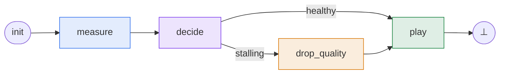
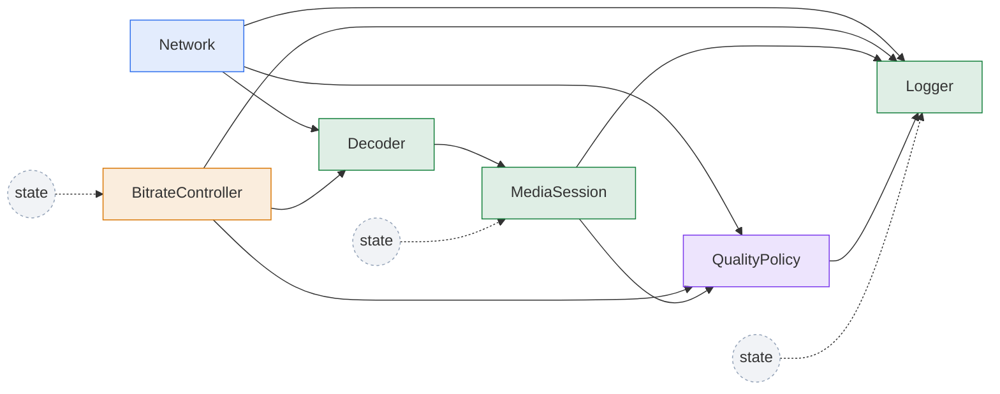
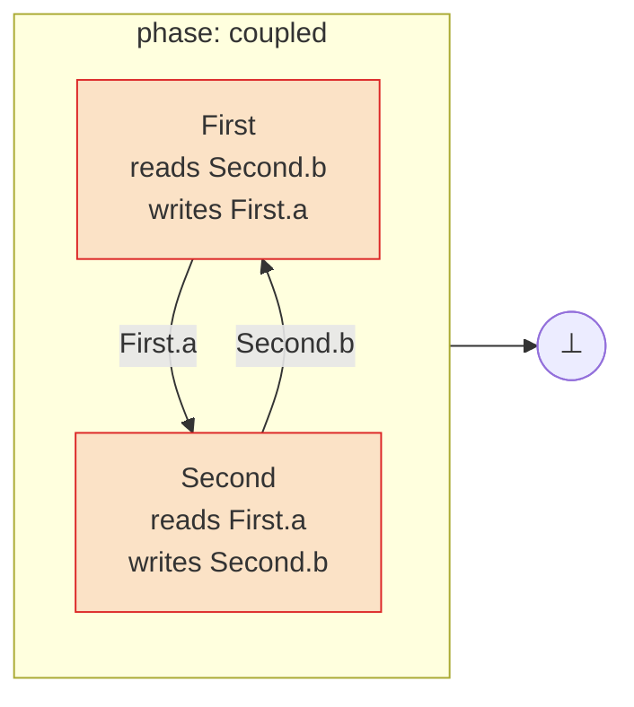
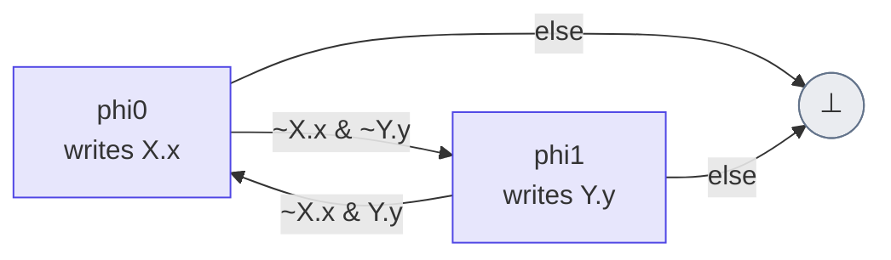
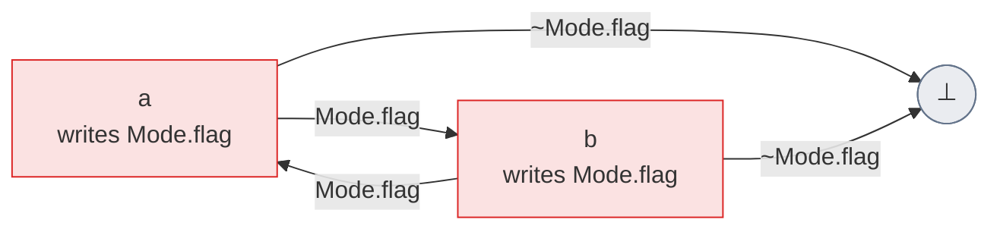
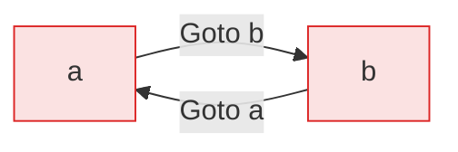

# Create, Compile, and Run a Phased Reactive System

## Recap

By this point the video player has three layers of declarations:

- node instances such as `Network`, `QualityPolicy`, and `MediaSession`;
- phases such as `measure`, `decide`, `drop_quality`, and `play`;
- transitions that say how one phase hands control to the next.

!!! example "The running example: an adaptive-bitrate video player"

    The player samples network bandwidth, decides whether the current bitrate
    is sustainable, optionally lowers quality, and then plays the next chunk.
    The buffer and bitrate persist across ticks, so the next tick starts from
    the state left by the previous one.


```mermaid
flowchart LR
    init([init]) --> measure
    measure --> decide[decide]
    decide -->|healthy| play
    decide -->|stalling| drop_quality
    drop_quality --> play
    play --> done([⊥])

    classDef measure fill:#2f6fed22,stroke:#2f6fed;
    classDef decide fill:#7c3aed22,stroke:#7c3aed;
    classDef dropQuality fill:#d9770622,stroke:#d97706;
    classDef play fill:#15803d22,stroke:#15803d;

    class measure measure;
    class decide decide;
    class drop_quality dropQuality;
    class play play;
```

| Phase | Nodes | What happens |
|---|---|---|
| <span class="phase-label phase-label--measure">measure</span> | `Network` | Sample the current bandwidth from the system clock. |
| <span class="phase-label phase-label--decide">decide</span> | `QualityPolicy` | Compare projected drain rate against the buffer; set `stalling`. |
| <span class="phase-label phase-label--drop-quality">drop_quality</span> | `BitrateController` | Drop the target bitrate by one rung. |
| <span class="phase-label phase-label--play">play</span> | `Decoder`, `MediaSession`, `Logger` | Compute downloaded seconds, integrate the buffer, log. |

At node level, the same model looks like this.
Solid arrows show that one node reads another node's state variable; dashed
arrows from `state` show self-reads, where a node reads its own state variable from
the previous tick.
The node colors correspond to the phase colors in the table above:


```mermaid
flowchart LR
    network["Network"]
    policy["QualityPolicy"]
    controller["BitrateController"]
    decoder["Decoder"]
    session["MediaSession"]
    logger["Logger"]
    controller_state(("state"))
    session_state(("state"))
    logger_state(("state"))

    network --> policy
    network --> decoder
    network --> logger
    controller --> policy
    controller --> decoder
    controller --> logger
    decoder --> session
    session --> logger
    session --> policy
    policy --> logger
    controller_state -.-> controller
    session_state -.-> session
    logger_state -.-> logger

    classDef measure fill:#2f6fed22,stroke:#2f6fed;
    classDef decide fill:#7c3aed22,stroke:#7c3aed;
    classDef dropQuality fill:#d9770622,stroke:#d97706;
    classDef play fill:#15803d22,stroke:#15803d;
    classDef state fill:#94a3b822,stroke:#94a3b8,stroke-dasharray:3 3;

    class network measure;
    class policy decide;
    class controller dropQuality;
    class decoder,session,logger play;
    class controller_state,session_state,logger_state state;
```

??? example "Full code listing: `examples/video_player/video_player.py`"

    ```python
    --8<-- "examples/video_player/video_player.py"
    ```

## What Regelum Checks

The PRS declaration is intentionally flexible: a model author can create
overlapping conditional transitions, omit a transition case, place mutually
dependent nodes in the same phase, or create a phase graph whose control flow
never reaches `terminate`.
Regelum therefore compiles and checks the declarative PRS structure before the
first runtime step.

The formal conditions are:

| Condition | Meaning | Runtime problem it prevents |
| --- | --- | --- |
| `C1` | Every phase-local node dependency graph is acyclic. | Nodes in one phase cannot require each other's current output in a circular order. |
| `C2` | The phase-transition graph is acyclic. | A tick cannot loop forever by following phase edges. |
| `C3` | For every phase and state, exactly one outgoing transition is enabled. | A phase cannot have either no next step or multiple possible next steps. |
| `C2*(n)` | No path of `n` internal transitions exists in any cyclic strongly connected component. | Together with C1 and C3, certifies tick termination even when execution alternates between cycles. |

`C1`, `C2`, and `C3` are sufficient structural conditions. For cyclic phase
graphs, Regelum uses `C2*(n)` instead of independent simple-cycle checks.
The solver checks all routes within each SCC, using symbolic phase identifiers,
post-update guards, and preservation of state not written by the current phase.
Node updates are conservatively allowed to choose any domain-valid values.

The checker increases `n` one transition at a time and passes a component only
on UNSAT. If all writable internal-guard variables `R_S` have finite domains,
the stopping bound is `N_S = number_of_phases * product_of_domain_sizes`.
Read-only guard variables remain fixed throughout each path.
All cyclic components must pass. A singleton is checked only if it has a self-loop.

Configure `c2star_depth` and `c2star_max_depth` (default budget: 64 transitions).
The effective budget is the minimum of the supplied limits and the finite bound,
when available. Earlier UNSAT can certify a component even when its finite bound
exceeds the budget or some domains are infinite.
The parameters count **internal SCC transitions, not cycle traversals**.
The name `C2*` denotes this SCC criterion throughout the current documentation.

SAT at the finite bound establishes possible infinite **local** residence, not
necessarily a reachable infinite tick. SAT below the bound, solver UNKNOWN,
unsupported internal guards, and exhausted budgets leave termination unproved.
These produce compile issues (and `CompileError` in strict mode); they never
produce a termination certificate. The checker is sufficient, not complete for
termination from reachable tick entries.

See [Tick termination with C2*(n)](termination.md) for the definition,
solver encoding, budget settings, diagnostics, and migration details.

Current Regelum checks these items concretely:

- **Node and phase consistency.** Every node state path must be unique; every
  node name must be unique; every input source must be connected, known, and
  unambiguous; every instance-bound input or guard source must belong to a node
  assigned to a phase; every phase target must resolve to another declared
  phase or to `terminate`.
- **Transition structure.** `Goto` cannot be mixed with `If` / `ElseIf` /
  `Else` chains. `ElseIf` and `Else` must follow an open `If` chain, and a
  chain cannot continue after `Else`.
- **C1 phase schedulability.** For each phase, Regelum builds edges from each
  active node to active nodes that read its state in the same phase. The phase
  is accepted only if those edges admit a topological order. The resolved order
  is stored in `compile_report.phase_schedules`.
- **C3 guarded-transition determinism.** Regelum converts `If` / `ElseIf` /
  `Else` chains into effective predicates. For symbolic predicates built with
  `rg.V(...)`, it uses Z3 to prove that no two effective predicates overlap and
  that their disjunction covers the relevant state space. For callable guards,
  it samples finite state domains when possible. A failure reports either an
  overlapping transition pair or a state where no transition is enabled.
- **C2 and C2* tick termination.** An acyclic graph passes immediately.
  Otherwise, iterative SCC traversal finds the cyclic components and Z3 checks
  bounded internal paths as described above. No simple cycles are enumerated.
- **Continuous-phase contract.** When a system has a continuous phase, Regelum
  also checks that a tick reaches exactly one continuous phase on every
  feasible path. This avoids silently choosing semantics for repeated
  continuous integration inside one logical tick.

## Build The Runtime System

At this point the declarations are still just Python objects: node instances,
phase objects, and transition objects.
They describe the intended feedback loop, but nothing has been scheduled or
executed yet.

`rg.PhasedReactiveSystem` is the boundary between declaration and runtime.
When you construct it, Regelum compiles the phase list into a concrete runtime
model: it resolves references, builds node schedules, checks transition
targets, computes initial-state requirements, and stores the result in
`compile_report`.

```python
import regelum as rg


def build_system() -> rg.PhasedReactiveSystem:
    network = Network()
    policy = QualityPolicy()
    controller = BitrateController()
    decoder = Decoder()
    session = MediaSession()
    logger = Logger()

    return rg.PhasedReactiveSystem(
        phases=[
            rg.Phase(
                "measure",
                nodes=(network,),
                transitions=(rg.Goto("decide"),),
                is_initial=True,
            ),
            rg.Phase(
                "decide",
                nodes=(policy,),
                transitions=(
                    rg.If(
                        rg.V(policy.State.stalling),
                        "drop_quality",
                        name="stalling",
                    ),
                    rg.Else("play", name="healthy"),
                ),
            ),
            rg.Phase(
                "drop_quality",
                nodes=(controller,),
                transitions=(rg.Goto("play"),),
            ),
            rg.Phase(
                "play",
                nodes=(decoder, session, logger),
                transitions=(rg.Goto(rg.terminate),),
            ),
        ],
    )
```

`rg.PhasedReactiveSystem` is the object you keep and run.
It owns the compiled phase graph, the current runtime state, and the compile
report.

## Constructor Behavior

The constructor receives the phases that define the system.

```python
system = rg.PhasedReactiveSystem(phases=phases)
```

During construction, `regelum` compiles the system.
If compilation succeeds, the returned object is ready for `step()`, `update()`,
`snapshot()`, `read(...)`, and `reset(...)`.
If compilation fails, the default behavior is to raise `CompileError`.

Use `strict=False` when you want to inspect a broken system instead of raising
immediately:

```python
system = rg.PhasedReactiveSystem(
    phases=phases,
    strict=False,
)

print(system.compile_report.issues)
```

## What compilation resolves

Compilation resolves:

- node names;
- input sources;
- instance connections;
- state paths;
- phase targets;
- guard references;
- phase schedules;
- dependency edges;
- required initial state variables.

For the video player, the report's `phase_schedules` shows the topologically
ordered nodes per phase. `minimal_initial_state_vars` lists the state variables
that must exist before their first read:
`BitrateController.value`, `Logger.history`, and
`MediaSession.buffer_seconds`.

## Compile report

Every `rg.PhasedReactiveSystem` stores a `compile_report`.
Read it before debugging runtime behavior; it tells you what the constructor
resolved and what it rejected.

```python
system = build_system()
report = system.compile_report

print(report.ok)
print(report.issues)
print(report.warnings)
print(report.phase_schedules)
print(report.minimal_initial_state_vars)
print(report.required_initial_state_vars)
```

For the video player this prints:

```text
True
()
()
{'measure': ('Network',), 'decide': ('QualityPolicy',), 'drop_quality': ('BitrateController',), 'play': ('Decoder', 'MediaSession', 'Logger')}
('BitrateController.value', 'Logger.history', 'MediaSession.buffer_seconds')
{'BitrateController.value': ('BitrateController.current', 'Decoder.bitrate_kbps', 'Logger.bitrate_kbps', 'QualityPolicy.bitrate_kbps'), 'Logger.history': ('Logger.history',), 'MediaSession.buffer_seconds': ('MediaSession.previous', 'QualityPolicy.buffer_seconds')}
```

Read this output as follows:

- `ok=True` means compilation produced no errors.
- `issues=()` means nothing was rejected. If a C1/C2/C3 check fails, this tuple
  contains `CompileIssue` objects naming the phase and condition.
- `warnings=()` means there are no non-fatal structural warnings.
- `phase_schedules` is the per-phase topological order. The `play` phase runs
  `Decoder` first, then `MediaSession`, then `Logger`, because the session
  reads `Decoder.State.fetched_seconds` and the logger reads the session state.
- `minimal_initial_state_vars` is the smallest set of state variables that must
  have a tick-zero value for this compiled graph.
- `required_initial_state_vars` maps each such state variable to the inputs
  that may read it before it is written in the current tick. The map is not an
  error by itself: in this example all three variables have `rg.var(init=...)`,
  so the constructor can initialize them automatically.

Use `format()` for the same report plus dependency edges:

```python
print(system.compile_report.format())
```

```text
ok = True
issues = ()
warnings = ()
minimal_initial_state_vars = ('BitrateController.value', 'Logger.history', 'MediaSession.buffer_seconds')
state_vars_without_initial = ('Decoder.fetched_seconds',)
required_initial_state_vars = {'BitrateController.value': ('BitrateController.current', 'Decoder.bitrate_kbps', 'Logger.bitrate_kbps', 'QualityPolicy.bitrate_kbps'), 'Logger.history': ('Logger.history',), 'MediaSession.buffer_seconds': ('MediaSession.previous', 'QualityPolicy.buffer_seconds')}
phase_schedules = {'measure': ('Network',), 'decide': ('QualityPolicy',), 'drop_quality': ('BitrateController',), 'play': ('Decoder', 'MediaSession', 'Logger')}
phase_dependency_edges = {'measure': (), 'decide': (), 'drop_quality': (), 'play': (('Decoder', 'MediaSession'), ('MediaSession', 'Logger'))}
```

`state_vars_without_initial` can contain variables that are still safe.
Here `Decoder.fetched_seconds` has no `init`, but it is written in `play`
before `MediaSession` reads it in the same phase. Therefore it is not listed in
`required_initial_state_vars` and does not produce an issue.

`minimal_initial_state_vars` is the smallest set of state variables that must
have a tick-zero value for this compiled graph.
Those values may come from `rg.var(init=...)`, from a callable initializer, or
from a runtime `initial_state` override.

`required_initial_state_vars` tells you which state variables are read before
they are guaranteed to be written by the compiled phase schedule.
If any of those variables has no declared `init` and no runtime override,
Regelum reports an issue.
You can use that list to build an `initial_state` mapping:

```python
missing = system.compile_report.required_initial_state_vars
print(missing)

system.reset(
    initial_state={
        MediaSession.State.buffer_seconds: 5.0,
        BitrateController.State.value: 720,
    }
)
```

In the video player, all required tick-zero state variables have either a
static initial value or a callable initializer.

## Common compile issues

Typical issues include:

- input source is not connected;
- input source is unknown;
- class-level reference is ambiguous;
- state path is duplicated;
- explicit node names are duplicated;
- state variable without initial value is read too early;
- phase graph is incomplete;
- transition target is unknown;
- transition chain is malformed.

## C1, C2, C3, and C2* Examples

Compilation rejects cyclic dependency graphs inside a phase.
This is the C1 check.
For the video player, the only non-trivial intra-phase dependency chain is
`Decoder → MediaSession → Logger` in `play`, which is acyclic.

For finite state variable domains, compilation also checks C3 by requiring exactly one
enabled transition per sampled state.
The branching in `decide` is `If(V(QualityPolicy.State.stalling),
"drop_quality")` plus `Else("play")`, with `stalling: bool` — boolean has a
finite domain, so C3 is verified statically.

The video-player phase graph is acyclic, so it satisfies C2 directly and does
not need a C2* cycle proof.

You can see all three facts in the compile report:

```python
from examples.video_player.video_player import build_system


system = build_system()
print(system.compile_report.format())
```

```text
ok = True
issues = ()
warnings = ()
minimal_initial_state_vars = ('BitrateController.value', 'Logger.history', 'MediaSession.buffer_seconds')
state_vars_without_initial = ('Decoder.fetched_seconds',)
required_initial_state_vars = {'BitrateController.value': ('BitrateController.current', 'Decoder.bitrate_kbps', 'Logger.bitrate_kbps', 'QualityPolicy.bitrate_kbps'), 'Logger.history': ('Logger.history',), 'MediaSession.buffer_seconds': ('MediaSession.previous', 'QualityPolicy.buffer_seconds')}
phase_schedules = {'measure': ('Network',), 'decide': ('QualityPolicy',), 'drop_quality': ('BitrateController',), 'play': ('Decoder', 'MediaSession', 'Logger')}
phase_dependency_edges = {'measure': (), 'decide': (), 'drop_quality': (), 'play': (('Decoder', 'MediaSession'), ('MediaSession', 'Logger'))}
```

For C1, inspect `phase_dependency_edges`: only `play` has intra-phase edges,
and they form a chain, not a cycle.
For C3, `issues=()` means the symbolic branch from `decide` has neither
overlap nor a missing case.
For C2, the phase graph has no edge returning to an earlier phase:
`measure -> decide -> drop_quality -> play -> terminate` and
`measure -> decide -> play -> terminate` are both finite paths.

### C1 Violation: One Phase Has A Node Cycle

C1 is local to a single phase.
The phase is invalid if the active nodes cannot be topologically ordered.
This example puts two mutually dependent nodes in one phase:


```mermaid
flowchart LR
    subgraph coupled["phase: coupled"]
        first["First<br/>reads Second.b<br/>writes First.a"]
        second["Second<br/>reads First.a<br/>writes Second.b"]
        first -->|"First.a"| second
        second -->|"Second.b"| first
    end
    coupled --> done([⊥])

    classDef bad fill:#dc262622,stroke:#dc2626;
    class first,second bad;
```

The corresponding script is `examples/compile_checks/c1_violation.py`.
It prints:

??? example "Full code listing: `examples/compile_checks/c1_violation.py`"

    ```python
    --8<-- "examples/compile_checks/c1_violation.py"
    ```

```text
coupled: C1 violation: phase dependency graph is cyclic (First->Second, Second->First)
```

The fix is to split the instantaneous cycle across phases, or to make one edge
read a state value from a previous tick instead of another node's current
output in the same phase.

### C2 Violated, But C2* Passes: A Dead Phase Cycle

C2 is syntactic: it rejects every cycle in the phase-transition graph.
That is safe, but conservative.
C2* checks whether execution can remain in the entire component for a
bounded number of transitions, including switching between cycles.

The split-write example has a cycle in the phase graph:


```mermaid
flowchart LR
    phi0["phi0<br/>writes X.x"]
    phi1["phi1<br/>writes Y.y"]
    done([⊥])

    phi0 -->|"~X.x & ~Y.y"| phi1
    phi0 -->|"else"| done
    phi1 -->|"~X.x & Y.y"| phi0
    phi1 -->|"else"| done

    classDef phase fill:#4f46e522,stroke:#4f46e5;
    classDef done fill:#64748b22,stroke:#64748b;
    class phi0,phi1 phase;
    class done done;
```

The first traversal can go `phi0 -> phi1 -> phi0`, but after `phi1` writes
`Y.y`, the guard from `phi0` back into the cycle requires `~Y.y`.
The cycle blocks itself. Therefore C2 fails syntactically, but C2* accepts the
system:

??? example "Full code listing: `examples/compile_checks/c2star_split_writes.py`"

    ```python
    --8<-- "examples/compile_checks/c2star_split_writes.py"
    ```

```text
compile ok = True
C2* status = pass
cycle phi0 -> phi1 -> phi0 is dead after one traversal
```

This is the kind of cyclic phase graph C2* is meant to keep: the graph contains
a loop, but no infinite tick execution can keep following it.

### C2* Violation: A Feasible Infinite Loop

Now compare a phase cycle whose guards can remain true forever:


```mermaid
flowchart LR
    a["a<br/>writes Mode.flag"]
    b["b<br/>writes Mode.flag"]
    done([⊥])

    a -->|"Mode.flag"| b
    a -->|"~Mode.flag"| done
    b -->|"Mode.flag"| a
    b -->|"~Mode.flag"| done

    classDef bad fill:#dc262622,stroke:#dc2626;
    classDef done fill:#64748b22,stroke:#64748b;
    class a,b bad;
    class done done;
```

Both phases write the same guard-relevant state variable, `Mode.flag`.
Under the compile-time abstraction, an update method may produce any
type-correct value for its state variable. Z3 can therefore find a witness in
which `Mode.flag` remains true on every traversal. Regelum rejects the cycle:

??? example "Full code listing: `examples/compile_checks/c2star_cycle.py`"

    ```python
    --8<-- "examples/compile_checks/c2star_cycle.py"
    ```

```text
SCC {a, b}: C2*: SAT at finite bound N_S=4; infinite local residence is possible, but global nontermination requires a reachable entry
```

Here `R_S=['Mode.flag']`: the component controls the same state
variable that its continuation guards read. Since the two-phase cycle can keep
choosing values that satisfy the cycle guards, it is a possible infinite loop.

### Plain C2 Violation: An Unconditional Cycle

An unconditional phase cycle is the simplest infinite-loop shape:


```mermaid
flowchart LR
    a["a"]
    b["b"]
    a -->|"Goto b"| b
    b -->|"Goto a"| a

    classDef bad fill:#dc262622,stroke:#dc2626;
    class a,b bad;
```

There is no guard that can block re-entry.
C2 fails because the phase graph is cyclic, and C2* also fails immediately:

??? example "Full code listing: `examples/compile_checks/unconditional_cycle.py`"

    ```python
    --8<-- "examples/compile_checks/unconditional_cycle.py"
    ```

```text
SCC {a, b}: C2*: SAT at finite bound N_S=2; infinite local residence is possible, but global nontermination requires a reachable entry
```

`R_S=[]` means no cycle-owned state variable is needed to keep the loop alive;
the unconditional edges alone are enough.

## Runtime

After construction, the same `rg.PhasedReactiveSystem` object is the runtime
handle.
Runtime executes the compiled phase schedules and updates system state.
It does not reinterpret declarations on every step.

### The tick

A tick walks the phase graph from the initial phase until a transition reaches
`terminate`.
For the video player, a healthy tick visits `measure → decide → play`; a
stalling tick visits `measure → decide → drop_quality → play`.

The feedback loop closes between ticks: `MediaSession.buffer_seconds` written
in `play` of tick N is read by `QualityPolicy` in `decide` of tick N+1, and
that read is what selects the branch.

Every system also has a built-in `rg.Clock`.
`Clock.tick` is incremented after the whole tick terminates.
In a discrete-only system, `Clock.time` advances with the tick by `base_dt`.
When a tick contains a continuous phase, `Clock.time` advances immediately
after that continuous phase, so later phases in the same tick can observe the
new physical time.
See [Continuous dynamics](continuous.md) for the ODE resolution rules.

### Step order

One `step()` starts at the initial phase and follows transitions until the
tick terminates.

For each phase:

1. run active nodes in the compiled schedule;
2. build each node input namespace;
3. call `update`;
4. normalize returned state variables;
5. write state variables into state;
6. choose the next phase from transitions.

```python
records = system.step()
```

Each record contains the phase, node, inputs, and state variables.
A 30-tick run of the player produces records like:

```python
for record in records:
    print(record.phase, record.node, record.state)
# measure Network {'bandwidth_kbps': 600.0}
# decide  QualityPolicy {'stalling': False}
# play    Decoder {'fetched_seconds': 0.278}
# play    MediaSession {'buffer_seconds': 9.11}
# play    Logger {'history': [...]}
```

### Running multiple ticks

Use `update(steps=...)` to execute several ticks.

```python
system.run(steps=30)
```

Each tick starts from the initial phase again.
State persists across ticks unless `reset()` is called.

### State access

Use `snapshot()` to inspect current state.
It returns user node state variables and committed ODE state values; system clock
fields are read explicitly.

```python
snapshot = system.snapshot()
print(snapshot["MediaSession.buffer_seconds"])
print(snapshot["BitrateController.value"])
```

Use `read(...)` when code has a state reference.

```python
buffer = system.read(session.State.buffer_seconds)
tick = system.read(rg.Clock.tick)
time = system.read(rg.Clock.time)
```

### Reset

`reset()` clears runtime state and history.
It then applies declared initial values and optional overrides.

```python
system.reset()
system.reset(initial_state={MediaSession.State.buffer_seconds: 5.0})
```

### Logging nodes

A logger is just another node.
It sees the values available at the point where its scheduled phase runs.
The video player puts `Logger` last in `play` so it observes the buffer
update from `MediaSession` and the freshly committed bitrate.

## Rules

- Read the compile report before debugging runtime behavior.
- Create systems with `rg.PhasedReactiveSystem(phases=[...])`.
- Use `strict=False` for diagnostics.
- Resolve ambiguous class references with instance connections.
- Add initial values only for state variables that must exist before execution.
- Runtime follows compiled phase schedules.
- State persists between ticks.
- `reset()` clears state and history.
- `step()` returns execution records.
- `snapshot()` returns user-visible state; use `read(rg.Clock.time)` for clock
  fields.
