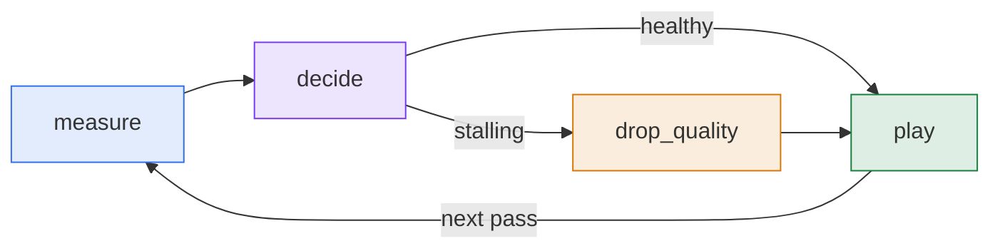
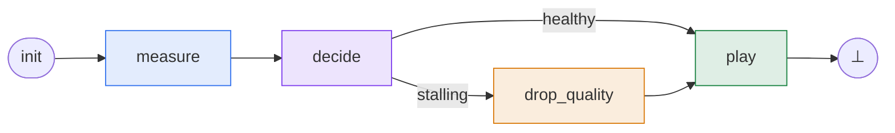
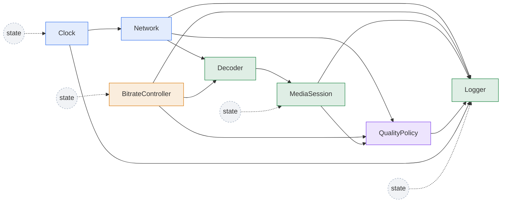

# Learn

`regelum` is a framework for modeling **Phased Reactive Systems**.
What that means is best understood through a concrete example, working from
the top down: starting with a continuously running system, breaking it into
something executable, and then descending one level at a time until we reach
the primitives the framework actually asks you to write.

!!! example "The running example: an adaptive-bitrate video player"

    Every adult has watched a video that quietly dropped from 1080p to 480p
    when the network slowed down.
    Let us think about how to model this process.

## The feedback loop

A video player never finishes by itself.
While you watch the current second of video, the player is also quietly
downloading the next few seconds in the background, so that playback does
not have to wait for the network on every frame.
That backlog of already-downloaded but not yet shown video is what we will
call the buffer in this example — measured in seconds of viewable content
sitting in memory ahead of the playhead.

If the network is fast, the buffer grows and the player has slack.
If the network slows down, the buffer shrinks; if it runs out completely,
playback stalls and the user sees a spinner.
The player's job is to make sure that does not happen — it watches how much
buffer is left, decides whether the current quality is sustainable, lowers
the quality if not, plays the next chunk, and then *goes back to watching
the buffer*.

This is a **feedback loop**: the result of one pass becomes the input of the
next, and the system runs forever as long as it is alive.



## Breaking the cycle into ticks

A diagram with a back-edge tells us what the system *is*, but not how to
*execute* it.
To run it, we cut the loop into a unit of work that has a clear start *and* a
clear end.
We declare an **initial** point — where every pass enters the graph — and a
terminator `⊥` — where every pass leaves it:



One such pass through the graph — from the initial point to `⊥` — is a
**tick**.
A tick is the unit of execution.

`⊥` is **not** the end of the system.
It is the end of one tick.
The original feedback loop is recovered by running tick after tick, with the
state values from the previous tick carried over into the next.
The cycle now lives *outside* the graph — between successive ticks — instead
of being drawn as an explicit edge.

## The high-level graph: phases and transitions

The graph above is still high-level: it tells us the shape of one tick, not
yet what each box actually does.

The boxes (`measure`, `decide`, `drop_quality`, `play`) are called
**phases**.
A phase is a labelled stage of one tick.

Each arrow leaving a phase carries a **predicate** that is evaluated at
runtime to decide whether that arrow fires:

- if a phase has *one* outgoing arrow, its predicate is trivially `true` —
  the arrow always fires.
- if a phase has *several* outgoing arrows, the predicates must be mutually
  exclusive — exactly one fires per tick.

In other words, **every arrow is conditional**; an unconditional transition
is just the special case where the condition is `True`.
This unifies sequential flow and branching under a single rule: at the end of
each phase, evaluate the predicates and follow the one that matches.

In the player, `decide` has two outgoing arrows:

- `If(stalling)` → `drop_quality`
- `Else` → `play`

while `measure`, `drop_quality`, and `play` each have a single arrow that
always fires.

## Phases up close: nodes

So far we have only described the *shape* of one tick: which phases exist,
which arrows connect them, which predicates gate the arrows.
That is enough to draw a diagram, but not enough to actually execute
anything.
To execute the system we need to make the high-level boxes concrete: what
variables exist, who reads them, who writes them, and what computation
happens inside each phase.

A phase is a high-level story.
It can be arbitrarily complex, and it is built out of smaller primitives
called **nodes**.
A node is an atomic unit of computation.

Every node has two kinds of variables:

- **inputs** — variables the node *reads*.
  An input is always the output of *some other* node (or the node's own
  output from a previous tick — that is how persistent state and feedback
  are expressed).
- **outputs** — variables the node *writes*.
  Each output is owned by exactly one node, so there is never any ambiguity
  about who produced a given value.

Alongside inputs and outputs, a node defines a `run` method.
This method is the node's basic computation: it receives the node's inputs as
arguments and returns the node's outputs.
In other words, inputs and outputs describe the data boundary, while `run`
contains the logic that transforms the current input values into the next
output values.

Inside a phase, several nodes can be active.
They are scheduled in topological order from their input/output dependencies,
so that every read sees a freshly written value when there is one.

For the video player, here is how the high-level phases decompose into
nodes:

| Phase | Nodes | What happens |
|---|---|---|
| <span class="phase-label phase-label--measure">measure</span> | `Clock`, `Network` | Advance the tick counter; sample the current bandwidth. |
| <span class="phase-label phase-label--decide">decide</span> | `QualityPolicy` | Compare projected drain rate against the buffer; set `stalling`. |
| <span class="phase-label phase-label--drop-quality">drop_quality</span> | `BitrateController` | Drop the target bitrate by one rung. |
| <span class="phase-label phase-label--play">play</span> | `Decoder`, `MediaSession`, `Logger` | Compute downloaded seconds, integrate the buffer, log. |

The same system at node level looks like this.
Solid arrows show that one node reads another node's output; dashed
arrows from `state` show self-reads, where a node reads its own output from
the previous tick.
The node colors correspond to the phase colors in the table above:



This is where the framework's actual work happens: writing node classes,
declaring their inputs and outputs, assigning instances to phases, and
attaching predicates to transitions.

??? example "Full code listing: `examples/video_player.py`"

    ```python
    --8<-- "examples/video_player.py"
    ```

## Where to go next

The remaining pages in this section walk through the model from the bottom
up — same model, opposite direction:

1. **Nodes** — declaring typed inputs, typed outputs, connections,
   initialization, and a `run` method.
2. **Phases** — assembling node instances into phases, declaring transitions,
   and reading the compiled schedule.
3. **Create, compile, and run** — constructing `rg.PhasedReactiveSystem`,
   reading the compile report, and executing ticks.
