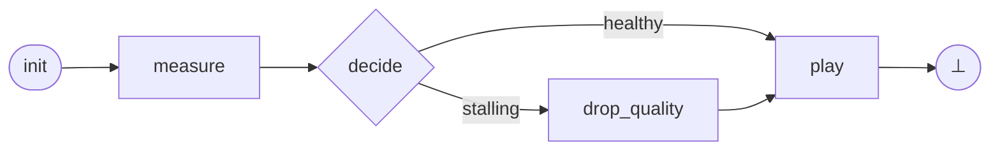

# Nodes

## Recap

In the overview we took the adaptive-bitrate video player and turned it into
a phase graph.

!!! example "The running example: an adaptive-bitrate video player"

    Every adult has watched a video that quietly dropped from 1080p to 480p
    when the network slowed down.
    The player keeps a few seconds of pre-downloaded video in a **buffer**;
    when the network slows it must lower the target quality before the
    buffer runs out.



One pass through this graph from `init` to `⊥` is a tick.
The graph is high-level; each phase is itself made of smaller pieces called
**nodes**, distributed like this:

| Phase | Nodes | What happens |
|---|---|---|
| `measure` | `Clock`, `Network` | Advance the tick counter; sample the current bandwidth. |
| `decide` | `QualityPolicy` | Compare projected drain rate against the buffer; set `stalling`. |
| `drop_quality` | `BitrateController` | Drop the target bitrate by one rung. |
| `play` | `Decoder`, `MediaSession`, `Logger` | Compute downloaded seconds, integrate the buffer, log. |

This page zooms in on those nodes — what a node is, how it declares its
inputs and outputs, how to instantiate it, and how its `run` method is
wired up.

## What a node is

A node is the **atomic unit of computation** in `regelum`.
It does not decompose any further: phases are stories built out of nodes, and
nodes are leaves of the system.

Every node is a contract of the form *given these inputs, produce these
outputs*.
That contract has three explicit pieces:

- **Inputs** — typed variables the node *reads*.
  An input is always bound to the *output of some other node*, or to the
  node's own output from a previous tick.
  Self-referential inputs are how persistent state and feedback are
  expressed: the node carries memory by reading what it itself wrote last
  time around.
- **Outputs** — typed variables the node *writes*.
  Each output is owned by exactly one node.
  No two nodes can claim the same variable: the system has at most one
  writer per name, so write/write races are impossible by construction
  and the producer of any value is unambiguous.
- **A `run` method** — the executable body of the contract.
  It receives a snapshot of the input values and returns a snapshot of the
  output values.
  The framework is responsible for marshalling state into and out of `run`;
  the node body just expresses computation.

A node by itself does nothing; it is *placed* in one or more phases.
When the runtime executes a phase, it calls `run` on each active node in
topological order — earlier nodes' outputs become later nodes' inputs within
the same phase.
Across phases and across ticks, those outputs persist as state.

In the video player, every node fits this shape: `Network` reads the tick
count and writes a bandwidth sample; `MediaSession` reads its own previous
buffer level plus newly downloaded seconds and writes the next buffer level;
`QualityPolicy` reads three values and writes a single boolean.
The rest of this page is about how those declarations are spelled in code.

## Classes and instances

A node class describes a reusable component.
A node instance is the concrete component placed into phases.

The simplest node in the player is `MediaSession`: it owns the buffer
level, fills it with newly fetched video, and drains it as playback consumes
seconds.

```python
import regelum as rg


class MediaSession(rg.Node):
    """The plant. Buffer fills with newly fetched video, drains with playback."""

    class Inputs(rg.NodeInputs):
        previous: float = rg.Input(
            source=lambda: MediaSession.Outputs.buffer_seconds
        )
        fetched: float = rg.Input(source=Decoder.Outputs.fetched_seconds)

    class Outputs(rg.NodeOutputs):
        buffer_seconds: float = rg.Output(initial=10.0)

    def run(self, inputs: Inputs) -> Outputs:
        next_buffer = inputs.previous + inputs.fetched - TICK_DT_SECONDS
        return self.Outputs(buffer_seconds=max(0.0, next_buffer))


session = MediaSession()
```

??? example "Full file: `examples/video_player.py`"

    ```python
    --8<-- "examples/video_player.py"
    ```

The class declares port shape and behavior.
The instance owns runtime identity and is the thing assigned to phases.

## Names

Each node instance has a name.
The name is used in state paths, compile reports, and snapshots.

If no name is passed, the class name is used.
Implicit duplicates are deduplicated automatically (`Plant`, `Plant_2`, ...).
Explicit duplicate names are compile errors.

```python
session_a = MediaSession()
session_b = MediaSession()
session_c = MediaSession(name="archive")
```

??? example "Full file: `examples/video_player.py`"

    ```python
    --8<-- "examples/video_player.py"
    ```

Custom constructors should forward `name` to `Node`.

```python
class Network(rg.Node):
    def __init__(self, *, name: str | None = None) -> None:
        super().__init__(name=name)
```

??? example "Full file: `examples/video_player.py`"

    ```python
    --8<-- "examples/video_player.py"
    ```

## Run methods

`run` computes outputs for one execution of the node.
It may receive an inputs namespace, no inputs, or compact input parameters.

Canonical form (used by `QualityPolicy`, `Decoder`, `MediaSession`, `Logger`):

```python
def run(self, inputs: Inputs) -> Outputs:
    return self.Outputs(stalling=...)
```

??? example "Full file: `examples/video_player.py`"

    ```python
    --8<-- "examples/video_player.py"
    ```

No-input nodes may write `run(self)`.

Compact nodes may declare inputs directly on `run` — the video player uses
this style for `Clock` and `Network`, where there is just one self-referential
input:

```python
class Clock(rg.Node):
    class Outputs(rg.NodeOutputs):
        tick: int = rg.Output(initial=0)

    def run(
        self,
        tick: int = rg.Input(source=lambda: Clock.Outputs.tick),
    ) -> Outputs:
        return self.Outputs(tick=tick + 1)
```

??? example "Full file: `examples/video_player.py`"

    ```python
    --8<-- "examples/video_player.py"
    ```

Do not mix compact `run` inputs with a `NodeInputs` namespace in the same
node.

## Rules

- A node class declares behavior and port shape.
- A node instance owns runtime identity and configuration.
- `run` should return the node output namespace.
- Node instances, not node classes, are assigned to phases.
