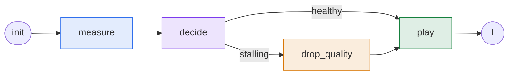
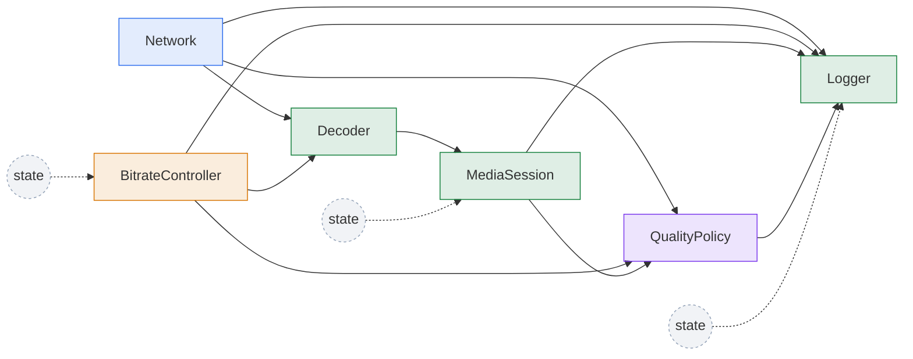

# Nodes

## Recap

In the overview we took the adaptive-bitrate video player and turned it into
a phase graph.

!!! example "The running example: an adaptive-bitrate video player"

    Every adult has watched a video that quietly dropped from 1080p to 480p
    when the network slowed down.
    The player keeps a few seconds of pre-downloaded video in a **buffer**;
    when the network slows it must lower the target quality before the
    buffer runs out.



One pass through this graph from `init` to `⊥` is a tick.
The graph is high-level; each phase is itself made of smaller pieces called
**nodes**, distributed like this:

| Phase | Nodes | What happens |
|---|---|---|
| <span class="phase-label phase-label--measure">measure</span> | `Network` | Sample the current bandwidth from the system clock. |
| <span class="phase-label phase-label--decide">decide</span> | `QualityPolicy` | Compare projected drain rate against the buffer; set `stalling`. |
| <span class="phase-label phase-label--drop-quality">drop_quality</span> | `BitrateController` | Drop the target bitrate by one rung. |
| <span class="phase-label phase-label--play">play</span> | `Decoder`, `MediaSession`, `Logger` | Compute downloaded seconds, integrate the buffer, log. |

At node level, the same model looks like this.
Solid arrows show that one node reads another node's state variable; dashed
arrows from `state` show self-reads, where a node reads its own state variable from
the previous tick.
The node colors correspond to the phase colors in the table above:



??? example "Full code listing: `examples/video_player.py`"

    ```python
    --8<-- "examples/video_player.py"
    ```

This page zooms in on those nodes — what a node is, how it declares its
inputs and state variables, how to instantiate it, and how its `update` method is
wired up.

## What is a Node?

A node is the **atomic unit of computation** in `regelum`: it reads named
input variables, writes named state variable variables, and implements a `update` method
that computes the next state variable values.

Each node declares its interface in terms of **inputs** and **state variables**.
Inputs say which values the node reads.
State say which values the node writes and, when needed, how those values
are initialized before the first tick.
The `update` method is the node's one-step computation: the runtime gives it
resolved inputs, and the method must return an `State` object.

!!! note "Nodes are classes; phases receive instances"

    A node in `regelum` is a Python class inherited from `rg.Node`.
    The class describes the node API and behavior.
    Concrete node instances are then placed into phases by literally listing
    them in the phase definition.

    Nodes may be connected across the overall system in many ways, including
    through values from previous ticks.
    However, the nodes passed to a single phase must form a DAG with respect
    to the read relation: draw an edge `Node X --> Node Y` when at least one
    state variable of `Node X` is an input of `Node Y` in that phase.
    This lets the runtime compile the phase and automatically resolve an
    execution order.

A representative node in the player is `MediaSession`: it owns the buffer
level, fills it with newly fetched video, and drains it as playback consumes
seconds.

```python
import regelum as rg


class MediaSession(rg.Node):
    """The plant. Buffer fills with newly fetched video, drains with playback."""

    class Inputs(rg.NodeInputs):
        previous: float = rg.Input(
            src=lambda: MediaSession.State.buffer_seconds
        )
        fetched: float = rg.Input(src=Decoder.State.fetched_seconds)

    class State(rg.NodeState):
        buffer_seconds: float = rg.Var(init=10.0)

    def update(self, inputs: Inputs) -> State:
        next_buffer = inputs.previous + inputs.fetched - TICK_DT_SECONDS
        return self.State(buffer_seconds=max(0.0, next_buffer))


session = MediaSession()
```

Let us break down what happens here.
`Inputs` declares variables the node reads.
`previous` reads `MediaSession.State.buffer_seconds`, so this is a
self-read from the previous tick.
`fetched` reads `Decoder.State.fetched_seconds`, so `MediaSession` depends
on `Decoder` in the `play` phase.
`State` declares variables the node writes.
`buffer_seconds` is initialized with `10.0` because the first tick needs a
buffer value before `MediaSession` has updated.
Finally, `update` receives the input snapshot and returns a state variable snapshot:
the node computes the next buffer level and writes it as `buffer_seconds`.

??? example "Full file: `examples/video_player.py`"

    ```python
    --8<-- "examples/video_player.py"
    ```

## Node API

A node in `regelum` is a Python class inherited from `rg.Node`.
The class declares the node's API: which variables it reads, which variables
it writes, and how one execution transforms inputs into state variables.

Every non-trivial node should make two namespaces explicit:

- `Inputs` lists the variables the node reads.
- `State` lists the variables the node writes.

Those namespaces are ordinary nested Python classes, subclassing
`rg.NodeInputs` and `rg.NodeState`.
This means the interface can be declared before any node instance exists:
`MediaSession.State.buffer_seconds` is a valid state reference at class
declaration time, even before `session = MediaSession()` is constructed.

```python
class MediaSession(rg.Node):
    class Inputs(rg.NodeInputs):
        fetched: float = rg.Input(src=Decoder.State.fetched_seconds)

    class State(rg.NodeState):
        buffer_seconds: float = rg.Var(init=10.0)
```

The runtime detects these namespaces by base class, not by name.
`Inputs` and `State` are the conventional names, and each node may declare
at most one input namespace and at most one state namespace.

### Inputs and state references

An input is connected to the state variable it reads.
The common form is `rg.Input(src=...)`, where `src` points at a state variable:

```python
class Network(rg.Node):
    ...


class Decoder(rg.Node):
    class Inputs(rg.NodeInputs):
        bandwidth_kbps: float = rg.Input(src=Network.State.bandwidth_kbps)
```

`Network.State.bandwidth_kbps` is a class-level reference.
It is concise and works when there is exactly one `Network` producer in the
compiled system.
If multiple instances of the same node class exist, use an instance-bound
reference such as `network.State.bandwidth_kbps`, or connect the ports after
instantiation.

```python
class Network(rg.Node):
    ...


network_main = Network(name="main")
network_backup = Network(name="backup")


class Decoder(rg.Node):
    class Inputs(rg.NodeInputs):
        bandwidth_kbps: float = rg.Input(
            src=network_main.State.bandwidth_kbps
        )
```

Here `Decoder` reads from the concrete `network_main` instance.
The `network_backup` instance can exist in the same system without making the
reference ambiguous.

A bare input annotation is shorthand for an unconnected input:

```python
class Inputs(rg.NodeInputs):
    value: float
```

This is equivalent to:

```python
class Inputs(rg.NodeInputs):
    value: float = rg.Input()
```

Unconnected inputs are compile errors unless connected later with
[post-instantiation connections](#post-instantiation-connections).

### Lazy references

Sometimes the producer cannot be referenced directly at class-body evaluation
time.
This happens when a node reads its own state variable, or when a producer class is
defined later in the file.
Use a zero-argument callable for those cases:

```python
class MediaSession(rg.Node):
    class Inputs(rg.NodeInputs):
        previous: float = rg.Input(
            src=lambda: MediaSession.State.buffer_seconds
        )
```

The `lambda` is not a different kind of connection.
It is a lazy reference: `regelum` resolves it during compilation, after Python
has finished creating the relevant classes.
It also keeps linters and type checkers from complaining about names that are
not available yet.

Self-referential inputs are how a node carries state across ticks.
Here `MediaSession` reads the `buffer_seconds` value it wrote in the previous
tick, then writes the next value in `update`.

### State

State are declared by subclassing `rg.NodeState`.
Each state variable is owned by exactly one node, so there is never ambiguity about
who produced a value.
This rules out write/write races by construction.

```python
class State(rg.NodeState):
    buffer_seconds: float = rg.Var(init=10.0)
```

A bare state variable annotation is shorthand for a state variable without an initial value:

```python
class State(rg.NodeState):
    fetched_seconds: float
```

`Decoder.fetched_seconds` can be declared this way because it is produced in
`play` before `MediaSession` reads it in the same phase.
Compilation rejects bare state variables that are read before they can be produced.

### Post-instantiation connections

Connections do not have to be fully described inside the node class.
You can instantiate nodes first and then link an input to a concrete state variable
with `port(...).connect(...)`.
This is useful when identity matters, especially in multi-instance systems.

```python
session_main = MediaSession(name="main")
session_pip = MediaSession(name="pip")
policy = QualityPolicy()

rg.port(policy.Inputs.buffer_seconds).connect(session_main.State.buffer_seconds)
```

The `port(...)` wrapper exposes `.connect(...)` while preserving the normal
descriptor syntax for type checkers and readers.
Both directions of `.connect(...)` are accepted as long as one side is an
input and the other side is a state variable:

```python
rg.port(policy.Inputs.buffer_seconds).connect(session_main.State.buffer_seconds)
rg.port(session_main.State.buffer_seconds).connect(policy.Inputs.buffer_seconds)
```

Input-to-input and state variable-to-state variable connections are errors.
If a class-level reference becomes ambiguous because several producers match,
the fix is to use an instance-bound reference or an explicit post-instantiation
connection.

### Initial values

System state stores state variable values.
Inputs read either values produced earlier in the same phase or values already
present in state.
An state variable needs an initial value when it may be read before the first time its
node runs.

```python
class MediaSession(rg.Node):
    class State(rg.NodeState):
        buffer_seconds: float = rg.Var(init=10.0)
```

`buffer_seconds` is read by `QualityPolicy` in `decide` before
`MediaSession` writes it in `play`, so it needs `init=10.0`.
The same idea applies to persistent state variables such as
`Network.bandwidth_kbps`, `BitrateController.value`, and
`QualityPolicy.stalling`.

Initial values can be written in three forms.
Use a direct value when the value is static:

```python
buffer_seconds: float = rg.Var(init=10.0)
```

Use a zero-argument callable for fresh mutable objects.
This avoids accidentally sharing one list between systems:

```python
class Logger(rg.Node):
    class State(rg.NodeState):
        history: list[Logger.Sample] = rg.Var(init=lambda: [])
```

Use a one-argument callable when the initial value depends on the node
instance.
The argument receives the concrete node instance; `self` is just the
recommended spelling:

```python
from typing import cast


class MediaSession(rg.Node):
    def __init__(
        self,
        *,
        initial_buffer: float = 10.0,
        name: str | None = None,
    ) -> None:
        super().__init__(name=name)
        self.initial_buffer = initial_buffer

    class State(rg.NodeState):
        buffer_seconds: float = rg.Var(
            init=lambda self: cast(MediaSession, self).initial_buffer,
        )


short_start = MediaSession(initial_buffer=2.0)
full_start = MediaSession(initial_buffer=10.0)
```

!!! note "Overriding initial state for a run"
    `initial_state` can override declared initial values for a single run
    without mutating the node declaration.

    ```python
    system.reset(
        initial_state={
            MediaSession.State.buffer_seconds: 5.0,
            BitrateController.State.value: 720,
        }
    )
    ```

    Once a system is instantiated, compilation has already resolved all state variable
    paths and can tell you which state variables define the initial state surface.
    Use `system.compile_report.minimal_initial_state_vars` to inspect the state variables
    that actually need initial values for this compiled graph, and
    `system.compile_report.required_initial_state_vars` to inspect the state variables
    that must be supplied because no declaration provides an initial value.

    ```python
    system = build_system()
    report = system.compile_report

    print(report.minimal_initial_state_vars)
    print(report.required_initial_state_vars)
    ```

    If `required_initial_state_vars` is non-empty, provide those values in
    `initial_state` before running or resetting the system.
    See [Compile report](compilation.md#compile-report) for inspecting the
    compiled initial-state requirements and [Reset](compilation.md#reset) for
    the runtime reset behavior.

### Run methods

`update` computes state variables for one execution of the node.
The canonical form receives the input namespace and returns the state variable
namespace:

```python
def update(self, inputs: Inputs) -> State:
    return self.State(buffer_seconds=...)
```

No-input nodes may write `update(self)`.
Compact nodes may declare inputs directly on `update`; this is useful for small
nodes with one or two inputs:

```python
class TickCounter(rg.Node):
    class State(rg.NodeState):
        tick: int = rg.Var(init=0)

    def update(
        self,
        tick: int = rg.Input(src=lambda: TickCounter.State.tick),
    ) -> State:
        return self.State(tick=tick + 1)
```

Do not mix compact `update` inputs with a `NodeInputs` namespace in the same
node.

### System clock inputs

Every `rg.PhasedReactiveSystem` has a built-in system clock. It is not a
`Node`, is not listed in any phase, and `Clock` is a reserved node name.
Read it through `rg.Clock.tick` and `rg.Clock.time`:

```python
class Network(rg.Node):
    class Inputs(rg.NodeInputs):
        tick: int = rg.Input(src=rg.Clock.tick)
        time: float = rg.Input(src=rg.Clock.time)
```

`Clock.tick` is the integer tick index. `Clock.time` is the physical time
computed from `tick * base_dt` for discrete-only systems, or from the latest
continuous integration boundary when the tick contains continuous dynamics.
The clock can also be used in guards, for example
`rg.If(rg.V(rg.Clock.tick) >= 10, rg.terminate)`.

### Mutating inputs

Inputs are normal Python objects.
If an input value is mutable, `update` receives a reference to that object.
The video player's `Logger` intentionally uses this for its own persistent
history: it reads its own previous `history`, appends one record, and writes
the same list back as the next state variable value.

```python
class Logger(rg.Node):
    class Inputs(rg.NodeInputs):
        history: list[Logger.Sample] = rg.Input(
            src=lambda: Logger.State.history
        )

    class State(rg.NodeState):
        history: list[Logger.Sample] = rg.Var(init=lambda: [])

    def update(self, inputs: Inputs) -> State:
        inputs.history.append(record)
        return self.State(history=inputs.history)
```

Even in this in-place pattern, `update` must still return an `State` object.
The returned state namespace is the only supported way to commit writes back
to system state.

This pattern is acceptable when the input is a self-read: the node is
mutating its own carried state.
Do not mutate inputs that belong to another node.
That creates hidden side effects outside the state variable contract, and Python
cannot reliably catch it at compile time.
Treat foreign inputs as read-only; mutating them inside `update` is against the
style guide.

## Instances and names

Each node instance has a name.
The name is used in state paths, compile reports, and snapshots.

If no name is passed, the class name is used.
Implicit duplicates are deduplicated automatically (`Plant`, `Plant_2`, ...).
Explicit duplicate names are compile errors.

```python
session_a = MediaSession()
session_b = MediaSession()
session_c = MediaSession(name="archive")
```

??? example "Full file: `examples/video_player.py`"

    ```python
    --8<-- "examples/video_player.py"
    ```

Custom constructors should forward `name` to `Node`.

```python
    def __init__(self, *, name: str | None = None) -> None:
        super().__init__(name=name)
```

## Rules

- A node class declares behavior and port shape.
- A node instance owns runtime identity and configuration.
- `update` must always return the node state namespace.
- Node instances, not node classes, are assigned to phases.
- Inputs read state variables.
- State define state values.
- Bare input annotations create unconnected inputs.
- Bare state variable annotations create state variables without initial values.
- Class-level references must resolve to exactly one producer.
- Use instance-bound references or `port(...).connect(...)` to remove
  ambiguity.
- Previous-state variables need initial values.
- Intermediate state variables may omit initial values.
- Mutable defaults should use callables.
