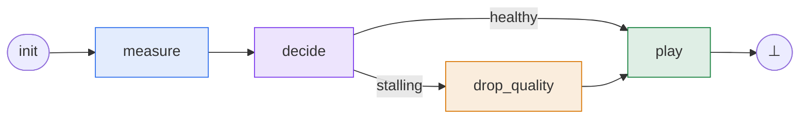
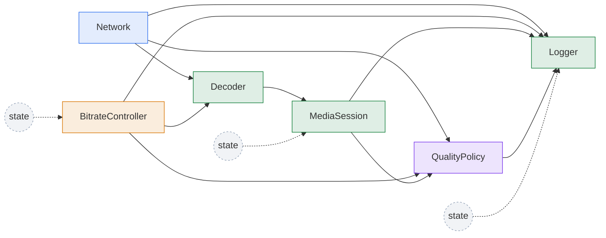

# Phases

## Recap

In the overview we took the adaptive-bitrate video player and cut its
feedback loop into ticks.
Each tick enters the phase graph at `init`, visits one or more named phases,
and leaves at `⊥`.

!!! example "The running example: an adaptive-bitrate video player"

    The player samples network bandwidth, decides whether the current bitrate
    is sustainable, optionally lowers quality, and then plays the next chunk.
    The buffer and bitrate persist across ticks, so the next tick starts from
    the state left by the previous one.



The graph has four phases:

| Phase | Nodes | What happens |
|---|---|---|
| <span class="phase-label phase-label--measure">measure</span> | `Network` | Sample the current bandwidth from the system clock. |
| <span class="phase-label phase-label--decide">decide</span> | `QualityPolicy` | Compare projected drain rate against the buffer; set `stalling`. |
| <span class="phase-label phase-label--drop-quality">drop_quality</span> | `BitrateController` | Drop the target bitrate by one rung. |
| <span class="phase-label phase-label--play">play</span> | `Decoder`, `MediaSession`, `Logger` | Compute downloaded seconds, integrate the buffer, log. |

At node level, the same model looks like this.
Solid arrows show that one node reads another node's state variable; dashed
arrows from `state` show self-reads, where a node reads its own state variable from
the previous tick.
The node colors correspond to the phase colors in the table above:



??? example "Full code listing: `examples/video_player.py`"

    ```python
    --8<-- "examples/video_player.py"
    ```

This page zooms in on how those phases are declared: which node instances
belong to each phase, where a tick starts, how nodes inside a phase are
scheduled, and how transitions choose the next phase.

## What a phase is

A phase is defined by two things:

- **nodes** — the node instances that are active together;
- **transitions** — the outgoing edges that choose the next phase, or
  terminate the current tick.

The nodes inside one phase must form a DAG with respect to their input/state
dependencies.
This is what lets the compiler resolve a deterministic topological order for
the phase.
Across the whole system there must also be exactly one initial phase, so every
tick has a single unambiguous entry point.

When a tick runs, it starts at the initial phase, executes that phase's nodes,
and then evaluates the phase's transitions.
Exactly one effective transition should be selected: zero true transitions
means the tick has nowhere to go, and more than one true transition means the
next phase is ambiguous.
With [symbolic predicates](#branch-chains), `regelum` can inspect the
phase graph during compilation and report structural problems before runtime
where possible.

The video player has four phases — `measure`, `decide`, `drop_quality`, and
`play`.
`measure` and `play` carry several nodes each; `decide` and `drop_quality`
each hold one.

## Phase API

A phase declaration has three main parts:

- a **name**, such as `"measure"` or `"play"`;
- `nodes`, a tuple of node instances that run together in that phase;
- `transitions`, a tuple of transition rules that choose what happens after
  the phase has executed.

It may also set `is_initial=True`.
The initial phase is where every tick enters the phase graph.
For the player, that is `measure`: a tick begins by sampling the network
before any decision is taken.

Phase names must be unique inside one `PhasedReactiveSystem`, because
transitions target phases by name.
Node instances also have runtime names, either explicit or derived by
`regelum`, and those names must be unique in the compiled system so diagnostics
and state paths are unambiguous.

!!! warning "Exactly one initial phase"

    Exactly one phase in a `PhasedReactiveSystem` must be marked
    `is_initial=True`.
    There is no fallback to the first phase, and more than one initial phase
    would make tick entry ambiguous.

!!! note "All nodes live in phases"

    Every node instance that belongs to the system must be listed in at least
    one phase.
    The system's node set is derived from phase declarations.
    The same node instance may be reused in multiple phases when it should run
    in more than one part of the tick.

```python
rg.Phase(
    "measure",
    nodes=(network,),
    transitions=(rg.Goto("decide"),),
    is_initial=True,
)
```

Here `nodes=(network,)` is the set of node instances active in the `measure`
phase.
`transitions=(rg.Goto("decide"),)` is the phase's transition rule set: in this
case, the rule is unconditional and sends control to `decide` after `measure`
finishes.

## Transitions

Transitions choose the next phase after the current phase has executed.
They may also terminate the current tick.

The video player uses symbolic predicates for the branching decision, plus
unconditional `Goto` transitions for the linear segments and
`Goto(terminate)` to end the tick.

### Goto

`Goto` is an unconditional transition.
It says where control goes after the current phase has finished.
There is no predicate to evaluate: if the phase reaches this transition, the
transition is taken.

Pass one of three target forms to `Goto`:

- a phase name, such as `"decide"`;
- a phase instance, when you already have the target object;
- `rg.terminate`, which ends the current tick.

```{.python .annotate}
rg.Phase(
    "measure",
    nodes=(network,),
    transitions=(rg.Goto("decide"),),  # (1)
    is_initial=True,
)

rg.Phase(
    "play",
    nodes=(decoder, session, logger),
    transitions=(rg.Goto(rg.terminate),),  # (2)
)
```

1. `rg.Goto("decide")` sends control to the phase named `"decide"` after
   `measure` has executed.
   The same target could also be passed as a phase instance when the object is
   already available.
2. `rg.Goto(rg.terminate)` does not choose another phase.
   It marks the current tick as complete.

### Branch chains

For branching, `regelum` uses ordinary `if` / `elif` / `else` semantics.
`If` starts a branch chain.
`Elif` continues the current chain.
`Else` closes the current chain and is taken only when none of the previous
predicates in that chain were true.
`ElseIf` is also available as an alias for `Elif`.

Every `If` and `Elif` transition takes a predicate as its first argument.
This predicate is the transition's **guard**.
A guard is a boolean condition over system variables: after the current phase
has executed, it evaluates to either `True` or `False`.
If the guard is `True`, that transition is enabled.

```python
rg.If(predicate, target, name=None)
rg.Elif(predicate, target, name=None)
```

- `target` is the phase to enter when the guard is true: a phase name, a
  phase instance, or `rg.terminate`;
- `name` is optional and gives the transition a stable diagnostic label.

The point of the guard is to make the outgoing edge explicit.
For the video player, the question is: did the policy detect that playback is
stalling?
If yes, the tick should enter `drop_quality`.
If no, the tick should continue to `play`.

The video player only needs `If` plus `Else`, because the policy publishes a
single boolean:

```python
rg.Phase(
    "decide",
    nodes=(policy,),
    transitions=(
        rg.If(rg.V(policy.State.stalling), "drop_quality", name="stalling"),
        rg.Else("play", name="healthy"),
    ),
)
```

`policy.State.stalling` is a state reference, not the current boolean
value.
`rg.V(policy.State.stalling)` means: read this state variable value when the
transition is evaluated.

Expressions that contain `rg.V(...)` build **symbolic guards** under the hood.
Use this form for transition guards by default: if a guard depends on a node
state variable, wrap that state reference with `rg.V(...)`.
Symbolic guards can also compare state variable values or terminate a tick:

```python
rg.If(rg.V(MediaSession.State.buffer_seconds) < 2.0, "buffer_warning")
rg.If(rg.V(policy.State.force_stop), rg.terminate, name="force_stop")
```

Keeping guards symbolic is what lets `regelum` reason about transitions
during graph compilation instead of treating them as opaque Python code.
The compiler can see which state variables the guard depends on and can check whether
the transition graph has structural problems, such as an ambiguous next phase
or a path that may fail to terminate where this can be proven.
Under the hood, this analysis is backed by
[Z3](https://github.com/Z3Prover/z3), an SMT solver.

`V(...)` accepts the same kinds of state references as inputs:

- state descriptors, such as
  `rg.V(MediaSession.State.buffer_seconds)`;
- instance-bound state ports, such as
  `rg.V(session.State.buffer_seconds)`;
- lazy callables, such as
  `rg.V(lambda: MediaSession.State.buffer_seconds)`;
- string references, such as
  `rg.V("MediaSession.buffer_seconds")`.

Enum state variables can be compared directly inside symbolic predicates:

```python
from enum import Enum


class PlaybackMode(Enum):
    PLAYING = "playing"
    PAUSED = "paused"


rg.If(rg.V(state.State.mode) == PlaybackMode.PLAYING, "play")
```

Python callables, including lambdas, can also be used as predicates when the
guard cannot be expressed symbolically:

```python
rg.If(lambda state: state.buffer_seconds < 2.0, "buffer_warning")
```

Callable predicates are an escape hatch.
Prefer symbolic `V(...)` predicates when possible, because they keep guard
dependencies visible to the compiler and produce clearer diagnostics.

A larger system might extend the chain with `Elif`:

```python
transitions = (
    rg.If(rg.V(policy.State.stalling), "drop_quality"),
    rg.Elif(rg.V(policy.State.healthy_steady), "upgrade_quality"),
    rg.Else("play"),
)
```

`Elif` after `Else` is invalid, because `Else` closes the current chain.

A phase may contain several independent `If` chains.
Compilation checks that the transition structure is well formed, and runtime
evaluates effective transitions in order.

For example, this transition tuple contains three chains: a single `If`, an
`If`/`Elif` chain, and another single `If`.

```python
transitions = (
    rg.If(rg.V(network.State.disconnected), "pause", name="offline"),
    rg.If(rg.V(policy.State.stalling), "drop_quality", name="stalling"),
    rg.Elif(rg.V(policy.State.can_upgrade), "upgrade_quality", name="upgrade"),
    rg.If(rg.V(logger.State.should_flush), "flush_logs", name="flush_logs"),
)
```

Each `If` starts a chain.
Each `Elif` continues the chain that immediately precedes it.
If guards are written with `rg.V(...)`, the compiler can see the guard
dependencies and verify the transition structure.
At execution time, the effective transitions should resolve to exactly one
selected next step; zero or multiple selected transitions make the next phase
ambiguous.

!!! warning "Avoid multiple Else branches in one transition tuple"

    A tuple like this is hard to reason about:

    ```python
    transitions = (
        rg.If(rg.V(network.State.disconnected), "pause", name="offline"),
        rg.Else("decide_quality", name="online"),

        rg.If(rg.V(policy.State.stalling), "drop_quality", name="stalling"),
        rg.Else("play", name="healthy"),
    )
    ```

    Each `Else` closes the chain immediately before it, but multiple `Else`
    branches in one phase usually hide the control flow rather than clarify it.
    Prefer explicit `If` / `Elif` chains and keep the phase's transition rules
    easy to audit.

## Rules

- Phases list node instances, not classes.
- A system is defined by its phases.
- Exactly one initial phase is expected.
- Each phase is scheduled topologically.
- Phase coverage must include input and guard producers.
- Use `Goto` for unconditional jumps.
- Use `If` / `Elif` / `Else` for ordered branches.
- Use `rg.terminate` to end a tick.
- Prefer symbolic `V(...)` predicates.
