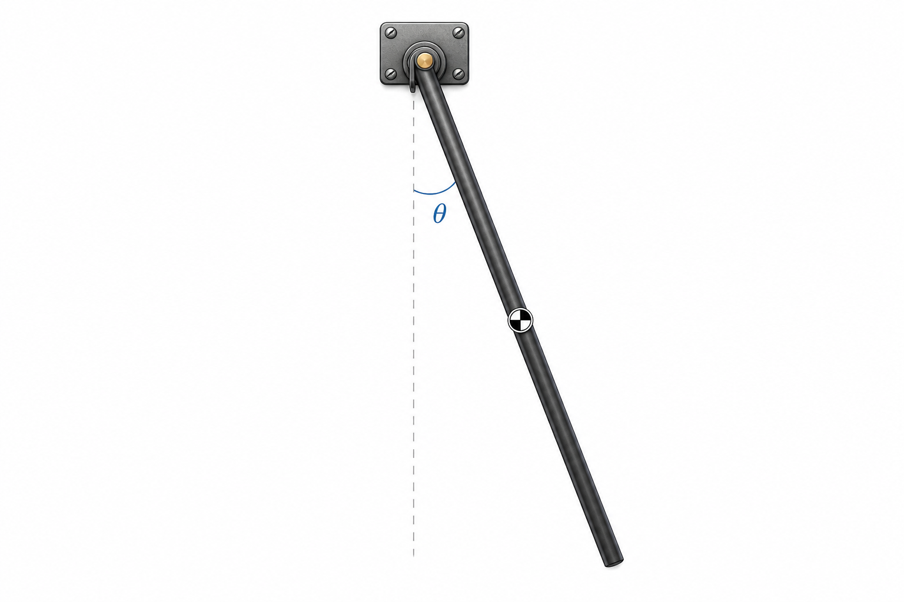
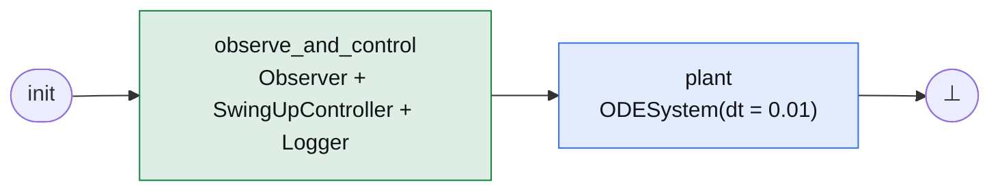
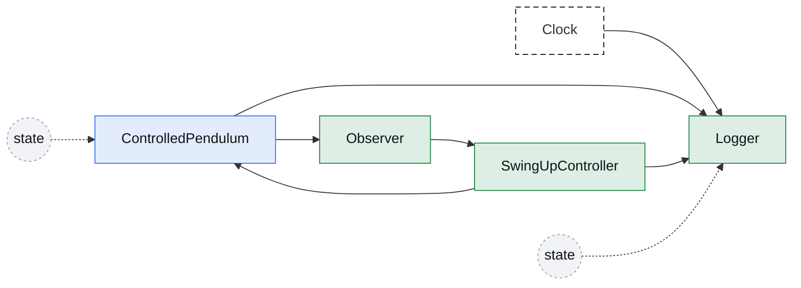
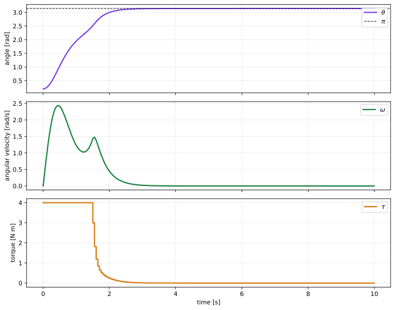

# Controlled Pendulum

[Open in molab](https://molab.marimo.io/github/aidagroup/regelum/blob/main/examples/controlled_pendulum/rg-examples-controlled-pendulum.py){ .md-button target="_blank" }

This example starts from the same rigid-rod pendulum, but now the plant has an
external torque input at the pivot. We add an observer, a swing-up controller,
and a logger. The plant runs on the base integration grid `dt=0.01`, while the
controller runs every `0.05` seconds. Between controller updates, the controller
torque is held in `SwingUpController.State.torque`, so the plant sees a
sample-and-hold control signal.



## Dynamics

The controlled plant is still a uniform rod with
\(I = m\ell^2 / 3\). It has the same \(\theta, \omega\) state and adds pivot
torque \(\tau\):

\[
\dot{\theta} = \omega,
\qquad
\dot{\omega} =
-\frac{3g}{2\ell}\sin(\theta) - d\omega + \frac{3\tau}{m\ell^2}.
\]

## Define The Plant

First we define the torque-driven plant. The plant reads torque from
`SwingUpController.State.torque`.

```python
class ControlledPendulum(rg.ODENode):
    def __init__(
        self,
        *,
        theta0: float = 0.2,
        omega0: float = 0.0,
        gravity: float = GRAVITY,
        length: float = LENGTH,
        mass: float = MASS,
        damping: float = DAMPING,
    ) -> None:
        self.theta0 = theta0
        self.omega0 = omega0
        self.gravity = gravity
        self.length = length
        self.mass = mass
        self.damping = damping

    class State(rg.NodeState):
        theta: float = rg.Var(init=lambda self: cast(ControlledPendulum, self).theta0)
        omega: float = rg.Var(init=lambda self: cast(ControlledPendulum, self).omega0)

    def dstate(
        self,
        state: State,
        torque: float = rg.Input(src=lambda: SwingUpController.State.torque),
    ) -> State:
        inertia = self.mass * self.length * self.length / 3.0
        theta_dot = state.omega
        omega_dot = (
            -(3.0 * self.gravity) / (2.0 * self.length) * ca.sin(state.theta)
            - self.damping * state.omega
            + torque / inertia
        )
        return self.State(theta=theta_dot, omega=omega_dot)
```

The plant is still just the physical system. It does not know how the torque is
computed; it only declares where torque comes from.

## Add Observer, Controller, And Logger

`Observer` reads the plant state and publishes angle features.

```python
class Observer(rg.Node):
    class State(rg.NodeState):
        sin_angle: float
        cos_angle: float
        angular_velocity: float

    def update(
        self,
        theta: float = rg.Input(src=ControlledPendulum.State.theta),
        omega: float = rg.Input(src=ControlledPendulum.State.omega),
    ) -> State:
        return self.State(
            sin_angle=math.sin(theta),
            cos_angle=math.cos(theta),
            angular_velocity=omega,
        )
```

`SwingUpController` reads the observer state and writes a torque. The controller
has `dt="0.05"`, so it only updates every five base ticks.

```python
class SwingUpController(rg.Node):
    class State(rg.NodeState):
        torque: float = rg.Var(init=0.0)

    def __init__(self, *, dt: str = CONTROL_DT) -> None:
        super().__init__(dt=dt)

    def update(
        self,
        sin_angle: float = rg.Input(src=Observer.State.sin_angle),
        cos_angle: float = rg.Input(src=Observer.State.cos_angle),
        angular_velocity: float = rg.Input(src=Observer.State.angular_velocity),
    ) -> State:
        theta = math.atan2(sin_angle, cos_angle)
        error = wrap_angle(theta - math.pi)
        raw = -self.kp * error - self.kd * angular_velocity
        torque = max(-self.torque_limit, min(self.torque_limit, raw))
        return self.State(torque=torque)
```

`Logger` records plant state and held torque:

```python
class Logger(rg.Node):
    class State(rg.NodeState):
        samples: list[tuple[float, float, float, float]] = rg.Var(init=list)

    def update(
        self,
        prev_state: State,
        time: float = rg.Input(src=rg.Clock.time),
        theta: float = rg.Input(src=ControlledPendulum.State.theta),
        omega: float = rg.Input(src=ControlledPendulum.State.omega),
        torque: float = rg.Input(src=SwingUpController.State.torque),
    ) -> State:
        sample = (time, theta, omega, torque)
        prev_state.samples.append(sample)
        return self.State(samples=prev_state.samples)
```

For variety, and to demonstrate the flexibility of regelum's API, this example
uses direct `update(...)` input parameters instead of nested `Inputs`
namespaces. The `rg.Input(src=...)` defaults are the links: they tell regelum
where each argument comes from. The observer variables use bare state
annotations because the phase graph guarantees that `Observer` runs before
`SwingUpController` reads those values. The annotations still declare state
ports that the controller can reference through `Observer.State.*`.

`SwingUpController.State.torque` still has `init=0.0`: on base ticks where the
controller is not scheduled, the plant reads the last held torque value.

## Build The System

First we create the physical plant and wrap it in an `ODESystem`:

```python
pendulum = ControlledPendulum()
plant = rg.ODESystem(nodes=(pendulum,), dt=BASE_DT)
```

`BASE_DT = "0.01"`, so this phase integrates the differential equation every
10 ms. Then we add the discrete nodes:

```python
observer = Observer()
controller = SwingUpController()
logger = Logger()
```

Finally we build the PRS:

```python
system = rg.PhasedReactiveSystem(
    phases=[
        rg.Phase(
            "observe_and_control",
            nodes=(observer, controller, logger),
            transitions=(rg.Goto("plant"),),
            is_initial=True,
        ),
        rg.Phase(
            "plant",
            nodes=(plant,),
            transitions=(rg.Goto(rg.terminate),),
        ),
    ],
    base_dt=BASE_DT,
)
```

One tick starts in `observe_and_control`. Inside that phase the compiler
resolves the dataflow as `Observer -> SwingUpController -> Logger`: the
observer publishes angle features, the controller writes torque, and the logger
records the current plant state plus the torque that will be held by the plant.
Then the `plant` phase integrates the rigid rod and the tick terminates.

Because the controller period is `0.05`, the controller state is updated only
on controller ticks. On the other base ticks, its last torque value is still
available to the plant. That is the sample-and-hold behavior.

## Phase Graph



## Node Graph

The controller reads observer features and writes torque. The plant reads that
torque, and the logger records both the plant state and the held torque. Dashed
`state` arrows show previous-state reads: `ControlledPendulum` reads its
physical state in `dstate(...)`, and `Logger` appends to its previous
sample tuple. Node colors follow phase colors: green for `observe_and_control`
and blue for `plant`.



## Phase Table

| Phase | Nodes | Role |
| --- | --- | --- |
| <span class="phase-label phase-label--observe">observe_and_control</span> | `Observer`, `SwingUpController(dt="0.05")`, `Logger` | Publishes angle features, computes held torque, and records a sample. |
| <span class="phase-label phase-label--plant">plant</span> | `ODESystem(ControlledPendulum, dt="0.01")` | Integrates the torque-driven differential equation on every base tick. |

## Node Table

| Node | State | Inputs |
| --- | --- | --- |
| <span class="node-label node-label--plant-phase">ControlledPendulum</span> | `theta`, `omega` | `SwingUpController.State.torque` |
| <span class="node-label node-label--observe-phase">Observer</span> | `sin_angle`, `cos_angle`, `angular_velocity` | `ControlledPendulum.State.theta`, `ControlledPendulum.State.omega` |
| <span class="node-label node-label--observe-phase">SwingUpController</span> | `torque` | observer state from the current tick when scheduled |
| <span class="node-label node-label--observe-phase">Logger</span> | `samples` | `Clock.time`, plant state, held torque |

## Run The Simulation

The notebook runs the system and reads `Logger.State.samples`:

```python
system = build_system()
system.run(1000)
samples = system.read(Logger.State.samples)
```

Then it plots angle, angular velocity, and torque. The torque plot uses a
step-style line, so the sample-and-hold behavior is visible: the controller
changes torque every `0.05` seconds while the plant continues integrating every
`0.01` seconds.



## Open In Marimo

Open the notebook in molab:

[Open in molab](https://molab.marimo.io/github/aidagroup/regelum/blob/main/examples/controlled_pendulum/rg-examples-controlled-pendulum.py){ .md-button target="_blank" }

Molab opens the notebook from the published `main` branch and installs
`regelum` from PyPI, plus plotting dependencies, using the notebook's inline
dependency metadata.

??? example "Standalone Python listing"

    ```python
    --8<-- "examples/controlled_pendulum/standalone.py"
    ```
