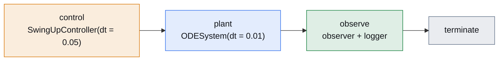
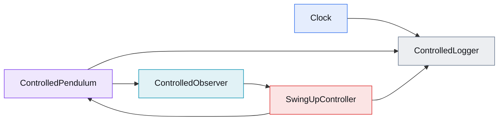

# Controlled Pendulum

[Open in molab](https://molab.marimo.io/github/aidagroup/regelum/blob/main/examples/controlled_pendulum/rg-examples-controlled-pendulum.py){ .md-button target="_blank" }

This example keeps the pendulum plant explicit, then adds a controller as a
separate stateful node. The important timing detail is sample-and-hold: the
plant integrates at `dt=0.01`, while the controller updates at `dt=0.05`.
Between controller updates the plant reads the held torque state.


## Dynamics

The controlled plant has the same \(\theta, \omega\) state and adds torque
\(\tau\) from `SwingUpController.State.torque`:

\[
\dot{\theta} = \omega,
\qquad
\dot{\omega} =
-\frac{g}{\ell}\sin(\theta) - d\omega + \frac{\tau}{m\ell^2}.
\]

```python
class ControlledPendulum(rg.ODENode):
    class Inputs(rg.NodeInputs):
        torque: float = rg.Input(src=lambda: SwingUpController.State.torque)

    class State(rg.NodeState):
        theta: float = rg.Var(init=lambda self: cast(ControlledPendulum, self).theta0)
        omega: float = rg.Var(init=lambda self: cast(ControlledPendulum, self).omega0)

    def dstate(self, inputs: Inputs, state: State) -> State:
        inertia = self.mass * self.length * self.length
        theta_dot = state.omega
        omega_dot = (
            -self.gravity / self.length * ca.sin(state.theta)
            - self.damping * state.omega
            + inputs.torque / inertia
        )
        return self.State(theta=theta_dot, omega=omega_dot)
```

`SwingUpController` runs every five base ticks because its `dt` is `0.05` and
the system `base_dt` is `0.01`. Its `torque` state remains available to the
plant on every base integration step.

## Phase Graph



## Node Graph



## Phase Table

| Phase | Nodes | Role |
| --- | --- | --- |
| <span class="phase-label phase-label--control">control</span> | `SwingUpController(dt="0.05")` | Computes a new torque on controller ticks. |
| <span class="phase-label phase-label--plant">plant</span> | `ODESystem(ControlledPendulum, dt="0.01")` | Integrates the torque-driven differential equation on every base tick. |
| <span class="phase-label phase-label--observe">observe</span> | `ControlledObserver`, `ControlledLogger` | Publishes observer signals and records state plus held torque. |

## Node Table

| Node | State | Inputs |
| --- | --- | --- |
| <span class="node-label node-label--pendulum">ControlledPendulum</span> | `theta`, `omega` | `SwingUpController.State.torque` |
| <span class="node-label node-label--observer">ControlledObserver</span> | `sin_angle`, `cos_angle`, `angular_velocity` | `ControlledPendulum.State.theta`, `ControlledPendulum.State.omega` |
| <span class="node-label node-label--controller">SwingUpController</span> | `torque` | observer state from the previous observed tick |
| <span class="node-label node-label--logger">ControlledLogger</span> | `samples` | `Clock.time`, plant state, held torque |

## Open In Marimo

Open the notebook in molab:

[Open in molab](https://molab.marimo.io/github/aidagroup/regelum/blob/main/examples/controlled_pendulum/rg-examples-controlled-pendulum.py){ .md-button target="_blank" }

Molab opens the notebook from the published `main` branch and installs
`regelum` from PyPI, plus plotting dependencies, using the notebook's inline
dependency metadata.

??? example "Standalone Python listing"

    ```python
    --8<-- "examples/controlled_pendulum/standalone.py"
    ```
