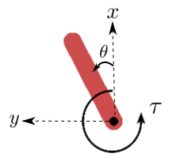
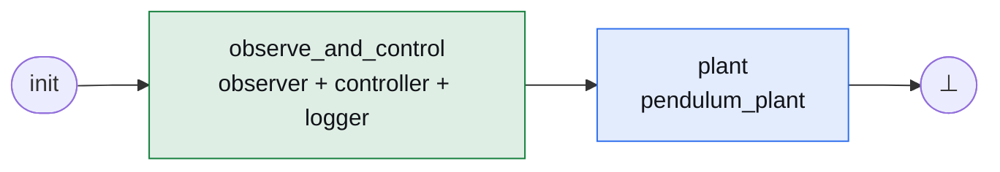
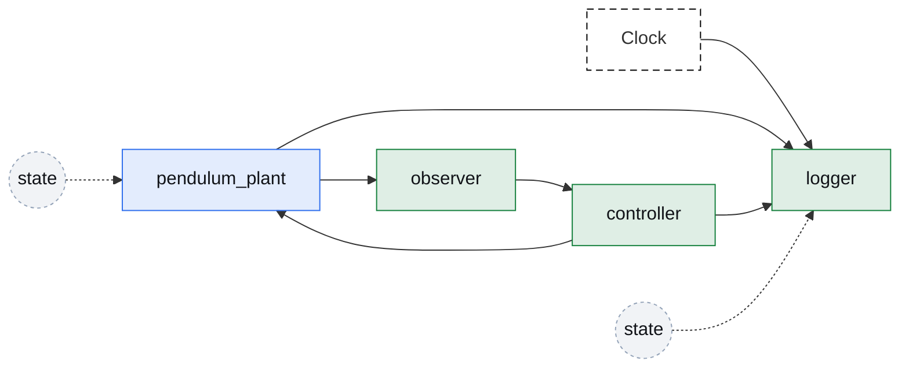
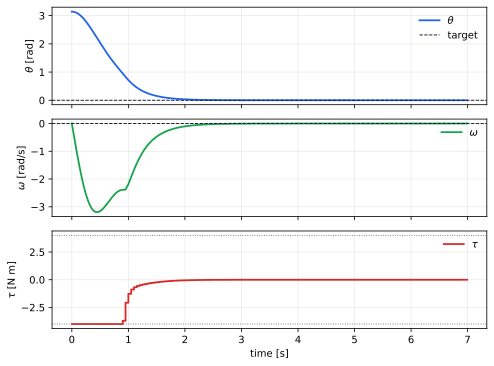

# Controlled Pendulum

[Open in molab](https://molab.marimo.io/github/aidagroup/regelum/blob/main/examples/controlled_pendulum/rg-examples-controlled-pendulum.py){ .md-button target="_blank" }

This example stabilizes the classical torque-driven pendulum benchmark. The
plant state is angle \(\theta\) and angular velocity \(\omega\), and the
control variable is pivot torque \(\tau\).

{ width="220" }

The example is intentionally small, but it exercises the main Regelum ideas:
continuous dynamics are declared as a right-hand side, discrete nodes declare
their state reads, and phases turn those local declarations into an executable
schedule.

## Dynamics

The plant uses the uniform-rod pendulum dynamics

\[
\dot{\theta} = \omega,
\qquad
\dot{\omega} =
\frac{3g}{2\ell}\sin(\theta) + \frac{3\tau}{m\ell^2}.
\]

The controller is a clipped PD law around the upright equilibrium:

\[
\tau =
\operatorname{clip}_{[-\tau_{\max}, \tau_{\max}]}
\left(-k_p\operatorname{atan2}(\sin\theta,\cos\theta)-k_d\omega\right).
\]

The executable example uses \(g=9.81\), \(\ell=1.0\), \(m=1.0\),
\(k_p=14.0\), \(k_d=4.0\), and \(\tau_{\max}=4.0\). The plant is integrated at
100 Hz with `dt="0.01"`, while the controller runs at 20 Hz with `dt="0.05"`.
Between controller updates, `Controller.State.tau` is sampled and held.

## Logical Nodes

The closed-loop model is decomposed into four logical nodes:

| Node | Role |
| --- | --- |
| `pendulum_plant` | An `ODESystem` wrapping `PendulumODE`; it integrates \(\theta,\omega\) and reads held \(\tau\). |
| `observer` | Reads plant state and publishes `sin_theta`, `cos_theta`, and `omega`. |
| `controller` | Reads observer features and writes saturated `tau`. |
| `logger` | Reads plant state, clock time, and held torque, then appends a sample. |

That split is the point of the example. The plant does not know how torque is
computed. The controller does not know how the ODE is integrated. The logger
does not own any of the physical state. Each node declares only the state it
owns and the ports it reads.

## Define The Plant

`PendulumODE` is the continuous primitive. It inherits from `rg.ODENode`, so it
only specifies state and `dstate(...)`; integration settings are supplied later
by `rg.ODESystem`.

```python
class PendulumODE(rg.ODENode):
    mass: float = 1.0
    length: float = 1.0
    gravity: float = 9.81

    def __init__(self, theta0: float, omega0: float) -> None:
        self.theta0 = theta0
        self.omega0 = omega0

    class State(rg.NodeState):
        theta: float = rg.var(init=lambda self: cast(PendulumODE, self).theta0)
        omega: float = rg.var(init=lambda self: cast(PendulumODE, self).omega0)

    def dstate(
        self,
        state: State,
        tau: float = rg.src(lambda: Controller.State.tau),
    ) -> State:
        tau_c = 3.0 / (self.mass * self.length**2)
        g_c = (3.0 * self.gravity) / (2.0 * self.length)
        return self.State(
            theta=state.omega,
            omega=g_c * ca.sin(state.theta) + tau_c * tau,
        )
```

The `theta` and `omega` variables use lazy initializers. At runtime the node
instance is passed to the initializer, so the constructor values become the
initial ODE state.

The torque input uses a lazy source reference:
`rg.src(lambda: Controller.State.tau)`. The lambda only delays evaluation
until `Controller` exists in the Python module. Semantically it is still a
plain state-port read.

## Observer

`Observer` is an ordinary discrete node. This snippet uses a separate
`Inputs` namespace, which is useful when a node has several named reads.

```python
class Observer(rg.Node):
    class State(rg.NodeState):
        sin_theta: float
        cos_theta: float
        omega: float

    class Inputs(rg.NodeInputs):
        theta: float = rg.src(PendulumODE.State.theta)
        omega: float = rg.src(PendulumODE.State.omega)

    def update(self, inputs: Inputs) -> State:
        return self.State(
            sin_theta=math.sin(inputs.theta),
            cos_theta=math.cos(inputs.theta),
            omega=inputs.omega,
        )
```

The return value is a new `Observer.State` object. Regelum commits it after the
node runs, and later nodes in the same phase can read those ports.

## Controller

`Controller` shows the compact input style: inputs are declared directly in the
`update(...)` signature. This is equivalent to a separate `Inputs` namespace.

```python
class Controller(rg.Node):
    dt: str = "0.05"
    tau_max: float = 4.0

    def __init__(self, kp: float, kd: float) -> None:
        self.kp = kp
        self.kd = kd

    class State(rg.NodeState):
        tau: float

    def update(
        self,
        sin_theta: float = rg.src(Observer.State.sin_theta),
        cos_theta: float = rg.src(Observer.State.cos_theta),
        omega: float = rg.src(Observer.State.omega),
    ) -> State:
        theta = math.atan2(sin_theta, cos_theta)
        raw = -self.kp * theta - self.kd * omega
        tau = float(np.clip(raw, -self.tau_max, self.tau_max))
        return self.State(tau=tau)
```

The class-level `dt` means the controller runs every 0.05 seconds. The plant
integrates every 0.01 seconds, so on intermediate base ticks the plant reads
the latest committed `Controller.State.tau`.

## Logger

`Logger` depends on its own previous state. Regelum passes the previous
`Logger.State` object into `update(...)` because the parameter is annotated as
`State`.

```python
class Logger(rg.Node):
    class State(rg.NodeState):
        samples: list[tuple[float, float, float, float]] = rg.var(init=list)

    def update(
        self,
        state: State,
        time: float = rg.src(rg.Clock.time),
        theta: float = rg.src(PendulumODE.State.theta),
        omega: float = rg.src(PendulumODE.State.omega),
        tau: float = rg.src(Controller.State.tau),
    ) -> State:
        state.samples.append((time, theta, omega, tau))
        return self.State(samples=state.samples)
```

`rg.Clock.time` is a library-provided system source. It is advanced by the PRS
runtime and can be read like any other input port.

## Build The PRS

The upper-level model contains no numerical equations. It instantiates nodes,
wraps the ODE node in an `ODESystem`, and declares the phase graph.

```python
pendulum = PendulumODE(theta0=theta0, omega0=omega0)
plant = rg.ODESystem(nodes=(pendulum,), dt="0.01")
observer = Observer()
controller = Controller(kp=kp, kd=kd)
logger = Logger()

system = rg.PhasedReactiveSystem(
    phases=[
        rg.Phase(
            "observe_and_control",
            nodes=(observer, controller, logger),
            transitions=(rg.Goto("plant"),),
            is_initial=True,
        ),
        rg.Phase(
            "plant",
            nodes=(plant,),
            transitions=(rg.Goto(rg.terminate),),
        ),
    ],
)
```

One tick starts in `observe_and_control`. Within that phase, Regelum resolves
the dataflow as `Observer -> Controller -> Logger`: the observer publishes
features, the controller writes torque, and the logger records the current
plant state plus held torque. The tick then enters `plant`, where the ODE
system integrates `PendulumODE`, and then terminates.

The active nodes of a phase must form an acyclic dependency graph with respect
to state reads. Phase transitions then define the top-level tick schedule.
Regelum checks both layers before simulation begins.

## Phase Graph


```mermaid
flowchart LR
    init([init]) --> observeControl["observe_and_control<br/>observer + controller + logger"]
    observeControl --> plant["plant<br/>pendulum_plant"]
    plant --> done([⊥])

    classDef observeControl fill:#15803d22,stroke:#15803d,color:#111318
    classDef plant fill:#2f6fed22,stroke:#2f6fed,color:#111318
    class observeControl observeControl
    class plant plant
```

## Node Graph

The low-level node graph records data dependencies. Dashed state arrows
represent previous-state reads: the plant ODE reads previous
\(\theta,\omega\), and the logger appends to previous samples.


```mermaid
flowchart LR
    clock["Clock"] --> logger["logger"]
    pendulum["pendulum_plant"] --> observer["observer"]
    observer --> controller["controller"]
    controller --> pendulum
    pendulum --> logger
    controller --> logger
    pendulum_state(("state")) -.-> pendulum
    logger_state(("state")) -.-> logger

    classDef observeControl fill:#15803d22,stroke:#15803d,color:#111318
    classDef plant fill:#2f6fed22,stroke:#2f6fed,color:#111318
    classDef clock fill:transparent,stroke:currentColor,stroke-dasharray:6 4
    classDef state fill:#94a3b822,stroke:#94a3b8,stroke-dasharray:3 3,color:#111318
    class observer,controller,logger observeControl
    class pendulum plant
    class clock clock
    class pendulum_state,logger_state state
```

## Tables

| Phase | Nodes | Role |
| --- | --- | --- |
| <span class="phase-label phase-label--observe">observe_and_control</span> | `Observer`, `Controller(dt="0.05")`, `Logger` | Publishes features, computes held torque, and records a sample. |
| <span class="phase-label phase-label--plant">plant</span> | `ODESystem(PendulumODE, dt="0.01")` | Integrates the continuous pendulum dynamics on every base tick. |

| Node | State | Inputs |
| --- | --- | --- |
| <span class="node-label node-label--plant-phase">PendulumODE</span> | `theta`, `omega` | `Controller.State.tau` |
| <span class="node-label node-label--observe-phase">Observer</span> | `sin_theta`, `cos_theta`, `omega` | `PendulumODE.State.theta`, `PendulumODE.State.omega` |
| <span class="node-label node-label--observe-phase">Controller</span> | `tau` | `Observer.State.sin_theta`, `Observer.State.cos_theta`, `Observer.State.omega` |
| <span class="node-label node-label--observe-phase">Logger</span> | `samples` | `Clock.time`, plant state, held torque |

## Run The Simulation

Run the standalone example:

```bash
uv run python examples/controlled_pendulum/standalone.py
```

Save the response plot:

```bash
uv run python examples/controlled_pendulum/standalone.py \
  --output docs/assets/examples/pendulum/controlled_pendulum_response_torque4.svg
```

The plot shows angle, angular velocity, and the held torque. The stair-step
torque trace is the direct sample-and-hold effect: `Controller` updates `tau`
five times more slowly (`dt="0.05"`) than `pendulum_plant` is integrated
(`dt="0.01"`).



## Open In Marimo

Open the notebook in molab:

[Open in molab](https://molab.marimo.io/github/aidagroup/regelum/blob/main/examples/controlled_pendulum/rg-examples-controlled-pendulum.py){ .md-button target="_blank" }

Molab opens the notebook from the published `main` branch and installs
`regelum` from PyPI, plus plotting dependencies, using the notebook's inline
dependency metadata.

??? example "Standalone Python listing"

    ```python
    --8<-- "examples/controlled_pendulum/standalone.py"
    ```
