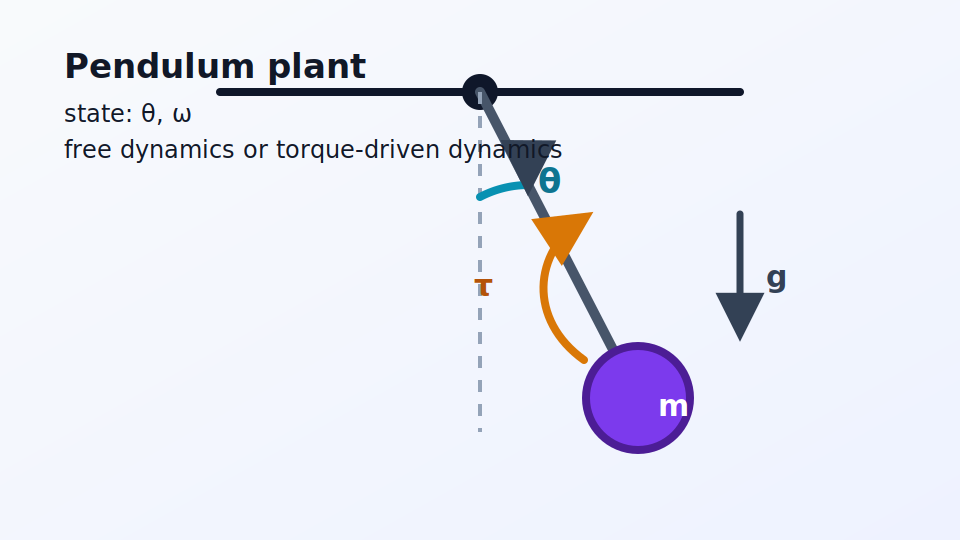
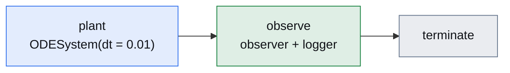
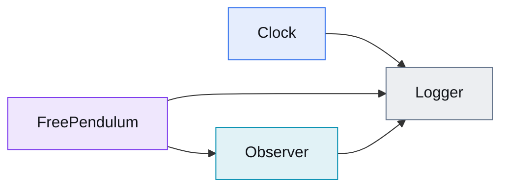

# Free Pendulum

[Open in molab](https://molab.marimo.io/github/aidagroup/regelum/blob/main/examples/free_pendulum/rg-examples-free-pendulum.py){ .md-button .md-button--primary target="_blank" }
[Run locally](#open-in-marimo){ .md-button }

This example starts from a single physical object: a damped pendulum without
external torque. The pendulum is implemented as an `ODENode`, integrated by an
`ODESystem`, and observed by a discrete node that publishes derived signals.



Run locally:

```bash
uv run marimo edit examples/free_pendulum/rg-examples-free-pendulum.py
```

## Dynamics

The state is the angle \(\theta\) and angular velocity \(\omega\):

\[
\dot{\theta} = \omega,
\qquad
\dot{\omega} = -\frac{g}{\ell}\sin(\theta) - d\omega .
\]

`FreePendulum.State` stores \(\theta\) and \(\omega\). Its `dstate` method
returns the two derivatives, and `ODESystem(..., dt="0.01")` integrates those
derivatives on the base simulation grid.

```python
class FreePendulum(rg.ODENode):
    class State(rg.NodeState):
        theta: float = rg.Var(init=lambda self: cast(FreePendulum, self).theta0)
        omega: float = rg.Var(init=lambda self: cast(FreePendulum, self).omega0)

    def dstate(self, state: State) -> State:
        theta_dot = state.omega
        omega_dot = (
            -self.gravity / self.length * ca.sin(state.theta)
            - self.damping * state.omega
        )
        return self.State(theta=theta_dot, omega=omega_dot)
```

`Observer` reads plant state and publishes \(\sin(\theta)\),
\(\cos(\theta)\), and \(\omega\).

## Phase Graph



## Node Graph



## Phase Table

| Phase | Nodes | Role |
| --- | --- | --- |
| <span class="phase-label phase-label--plant">plant</span> | `ODESystem(FreePendulum)` | Integrates the torque-free differential equation. |
| <span class="phase-label phase-label--observe">observe</span> | `Observer`, `Logger` | Publishes observer signals and records samples for plotting. |

## Node Table

| Node | State | Inputs |
| --- | --- | --- |
| <span class="node-label node-label--pendulum">FreePendulum</span> | `theta`, `omega` | none |
| <span class="node-label node-label--observer">Observer</span> | `sin_angle`, `cos_angle`, `angular_velocity` | `FreePendulum.State.theta`, `FreePendulum.State.omega` |
| <span class="node-label node-label--logger">Logger</span> | `samples` | `Clock.time`, plant state, observer state |

## Open In Marimo

Open the notebook in molab:

[Open in molab](https://molab.marimo.io/github/aidagroup/regelum/blob/main/examples/free_pendulum/rg-examples-free-pendulum.py){ .md-button .md-button--primary target="_blank" }

Molab opens the notebook from the published `main` branch and installs
`regelum` from PyPI, plus plotting dependencies, using the notebook's inline
dependency metadata.

Run the notebook locally from the repository root:

```bash
uv run marimo edit examples/free_pendulum/rg-examples-free-pendulum.py
```

The local command opens the current working copy, including changes that have
not been pushed to GitHub yet.

??? example "Standalone Python listing"

    ```python
    --8<-- "examples/free_pendulum/standalone.py"
    ```
