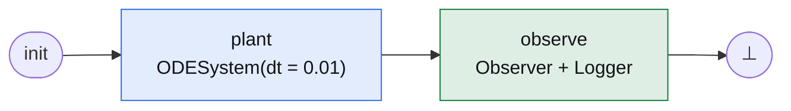
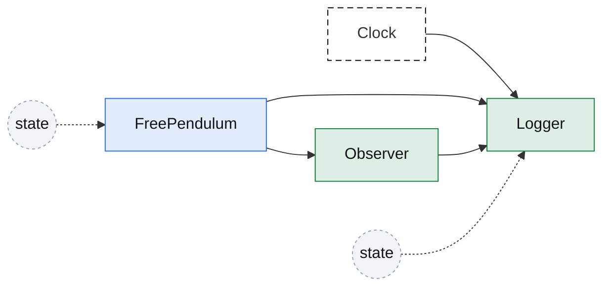
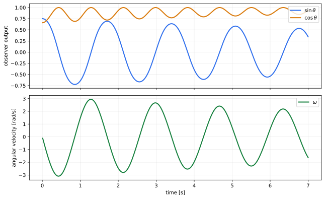

# Free Pendulum

[Open in molab](https://molab.marimo.io/github/aidagroup/regelum/blob/main/examples/free_pendulum/rg-examples-free-pendulum.py){ .md-button target="_blank" }

This example builds the smallest useful rigid-rod pendulum system: one
continuous plant, one observer, and one logger. There is no control torque here.
The goal is to show how a differential equation becomes an `ODENode`, how that
node is wrapped in an `ODESystem`, and how regular discrete nodes can read the
plant state.


## Dynamics

The plant is a uniform rigid rod of length \(\ell\), mass \(m\), and pivot at
one end. Its center of mass is at \(\ell / 2\), and its moment of inertia around
the pivot is \(I = m\ell^2 / 3\).

The state is the angle \(\theta\) and angular velocity \(\omega\):

\[
\dot{\theta} = \omega,
\qquad
\dot{\omega} = -\frac{3g}{2\ell}\sin(\theta) - d\omega .
\]

There is no input torque in this first example. The only dynamics are gravity
and damping. The damping coefficient \(d\) is modeled directly in angular
acceleration units.

## Define The Plant

First we define the plant node. It is an `rg.ODENode`, so it has a `State`
namespace and a `dstate(...)` method. The `State` namespace stores the physical
state. The `dstate(...)` method returns the right-hand side of the ODE.

```python
class FreePendulum(rg.ODENode):
    class State(rg.NodeState):
        theta: float = rg.Var(init=lambda self: cast(FreePendulum, self).theta0)
        omega: float = rg.Var(init=lambda self: cast(FreePendulum, self).omega0)

    def dstate(self, state: State) -> State:
        theta_dot = state.omega
        omega_dot = (
            -(3.0 * self.gravity) / (2.0 * self.length) * ca.sin(state.theta)
            - self.damping * state.omega
        )
        return self.State(theta=theta_dot, omega=omega_dot)
```

The important point is that `theta` and `omega` are not method-local variables.
They are regelum state variables. Other nodes can connect to
`FreePendulum.State.theta` and `FreePendulum.State.omega`, and the ODE
integrator will update them over time.

## Add Observer And Logger

Next we add two ordinary discrete nodes.

`Observer` reads the plant state and publishes derived signals:
\(\sin(\theta)\), \(\cos(\theta)\), and \(\omega\). This is useful because a
controller or downstream pipeline often wants angle features rather than the raw
angle.

```python
class Observer(rg.Node):
    class Inputs(rg.NodeInputs):
        theta: float = rg.Input(src=FreePendulum.State.theta)
        omega: float = rg.Input(src=FreePendulum.State.omega)

    class State(rg.NodeState):
        sin_angle: float
        cos_angle: float
        angular_velocity: float

    def update(self, inputs: Inputs) -> State:
        return self.State(
            sin_angle=math.sin(inputs.theta),
            cos_angle=math.cos(inputs.theta),
            angular_velocity=inputs.omega,
        )
```

`Logger` reads the clock, the plant, and the observer, then appends one sample
to its own `samples` state.

```python
class Logger(rg.Node):
    class Inputs(rg.NodeInputs):
        time: float = rg.Input(src=rg.Clock.time)
        theta: float = rg.Input(src=FreePendulum.State.theta)
        sin_angle: float = rg.Input(src=Observer.State.sin_angle)
        cos_angle: float = rg.Input(src=Observer.State.cos_angle)
        angular_velocity: float = rg.Input(src=Observer.State.angular_velocity)

    class State(rg.NodeState):
        samples: list[tuple[float, float, float, float, float]] = rg.Var(init=list)

    def update(self, inputs: Inputs, prev_state: State) -> State:
        sample = (
            inputs.time,
            inputs.theta,
            inputs.sin_angle,
            inputs.cos_angle,
            inputs.angular_velocity,
        )
        prev_state.samples.append(sample)
        return self.State(samples=prev_state.samples)
```

Here `Observer.State.*` uses bare annotations intentionally. These variables do
not need initial values because `Logger` reads them only after `Observer` has
produced them in the same `observe` phase. The annotations still declare state
ports, so other nodes can reference `Observer.State.sin_angle`,
`Observer.State.cos_angle`, and `Observer.State.angular_velocity`.

`Logger.State.samples` does need `init=list`, because the logger receives its
previous state as `prev_state` and mutates the previous sample list with
`append`. The callable `list` is used instead of `[]` so every system reset
starts from a fresh list object.

## Build The System

Now we instantiate the plant and put it into an `ODESystem`.

```python
pendulum = FreePendulum()
plant = rg.ODESystem(nodes=(pendulum,), dt=BASE_DT)
```

This line is the bridge between "a node that describes derivatives" and "a
phase node that integrates continuous dynamics". Here `BASE_DT = "0.01"`, so
the pendulum is integrated on a 10 ms base grid.

Then we instantiate the observer and logger and build the PRS:

```python
observer = Observer()
logger = Logger()

system = rg.PhasedReactiveSystem(
    phases=[
        rg.Phase(
            "plant",
            nodes=(plant,),
            transitions=(rg.Goto("observe"),),
            is_initial=True,
        ),
        rg.Phase(
            "observe",
            nodes=(observer, logger),
            transitions=(rg.Goto(rg.terminate),),
        ),
    ],
    base_dt=BASE_DT,
)
```

The first phase integrates the continuous plant. The second phase runs the
discrete observer and logger. The tick ends at `rg.terminate`. Вуаля: the
system is ready to simulate.

## Phase Graph

Every tick starts at `init`, enters the initial phase, and ends at `⊥`.



## Node Graph

The node graph is the dataflow inside those phases. Solid arrows mean "reads
state from another node". Dashed arrows from `state` show self-reads from the
previous tick: `FreePendulum` reads its own physical state in `dstate(...)`,
and `Logger` reads its own `samples` tuple before appending a new row. The node
colors follow phase colors: blue nodes run in `plant`, green nodes run in
`observe`.



## Phase Table

| Phase | Nodes | Role |
| --- | --- | --- |
| <span class="phase-label phase-label--plant">plant</span> | `ODESystem(FreePendulum)` | Integrates the torque-free differential equation. |
| <span class="phase-label phase-label--observe">observe</span> | `Observer`, `Logger` | Publishes observer signals and records samples for plotting. |

## Node Table

| Node | State | Inputs |
| --- | --- | --- |
| <span class="node-label node-label--pendulum">FreePendulum</span> | `theta`, `omega` | none |
| <span class="node-label node-label--observer">Observer</span> | `sin_angle`, `cos_angle`, `angular_velocity` | `FreePendulum.State.theta`, `FreePendulum.State.omega` |
| <span class="node-label node-label--logger">Logger</span> | `samples` | `Clock.time`, plant state, observer state |

## Run The Simulation

The notebook runs the system, reads `Logger.State.samples`, and plots the
observer signals.

```python
system = build_system()
system.run(700)
samples = system.read(Logger.State.samples)
```

After that we unpack `time`, `sin_angle`, `cos_angle`, and `omega`, then draw
two plots: trigonometric observer outputs on top and angular velocity below.
This lets us inspect how the free pendulum swings and damps out over time.



## Open In Marimo

Open the notebook in molab:

[Open in molab](https://molab.marimo.io/github/aidagroup/regelum/blob/main/examples/free_pendulum/rg-examples-free-pendulum.py){ .md-button target="_blank" }

Molab opens the notebook from the published `main` branch and installs
`regelum` from PyPI, plus plotting dependencies, using the notebook's inline
dependency metadata.

??? example "Standalone Python listing"

    ```python
    --8<-- "examples/free_pendulum/standalone.py"
    ```
