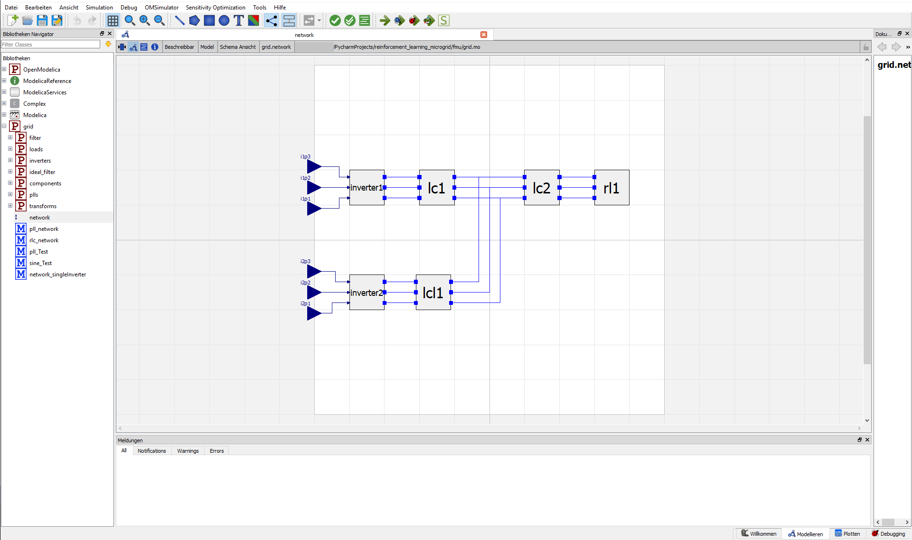
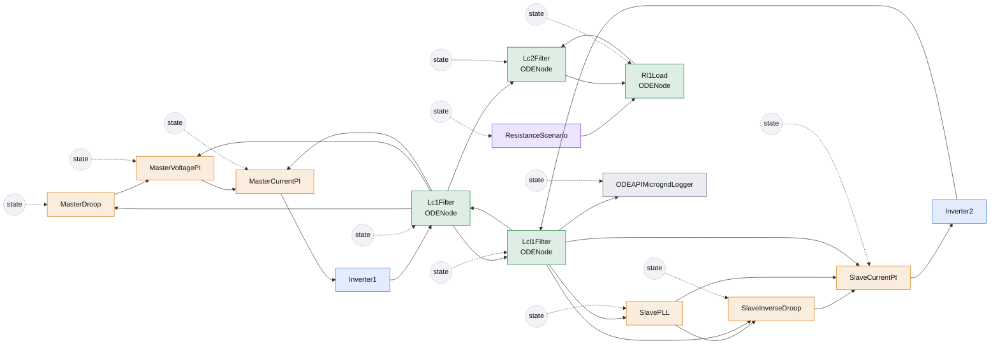
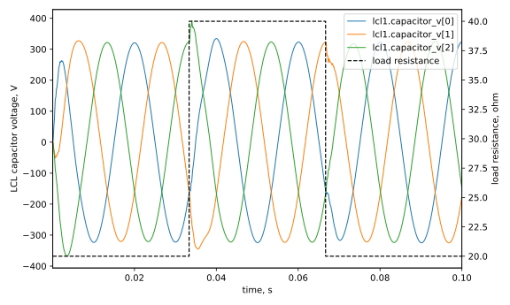

# Two Inverter Static Droop Control

This example simulates a native two-inverter microgrid inspired by the
[OpenModelica Microgrid Gym two inverter static droop control example](https://upb-lea.github.io/openmodelica-microgrid-gym/parts/user_guide/examples/two_inverter_static_droop_control.html).
The original OpenModelica network is useful as the physical schematic: two
three-phase inverters feed a shared AC network and load through output filters.



The upper branch is the master inverter. It is voltage-forming: it tries to
shape the AC bus voltage and frequency. The lower branch is the slave inverter.
It is current-sourcing: it synchronizes to the local voltage and injects current
according to the inverse droop law. In the original network image, the upper
branch uses an LC filter `lc1`; the lower branch uses an LCL filter `lcl1`; the
right side is the shared load network.

The runnable Regelum example lives in
`examples/two_inverter_static_droop/standalone.py`. It is a complete standalone
script with the controller, branch dynamics, PRS construction, and plotting in
one file, so it can be simulated without an OpenModelica/FMU runtime.

```bash
uv run python examples/two_inverter_static_droop/standalone.py
```

## Control Idea

The microgrid has to keep the AC bus in a useful operating region while both
inverters share the load.

The master inverter uses direct droop control. It measures instantaneous active
and reactive power at the bus:

\[
P = v_{abc}^{\mathsf{T}} i_{abc},
\qquad
Q \approx -\frac{1}{\sqrt{3}}
\begin{bmatrix}
v_b - v_c & v_c - v_a & v_a - v_b
\end{bmatrix}
i_{abc}.
\]

Then it shifts its frequency and voltage setpoint through filtered droop laws:

\[
f^\star = f_\mathrm{nom} + D_P(P),
\qquad
V^\star = V_\mathrm{nom} + D_Q(Q).
\]

Those setpoints go through voltage and current PI loops, and the result is a
three-phase modulation signal for the master inverter.

The slave inverter does the opposite direction. It runs a PLL on its local
capacitor voltage, estimates the local frequency, and uses inverse droop:

\[
i_d^\star \sim D_P^{-1}(f - f_\mathrm{nom}),
\qquad
i_q^\star \sim D_Q^{-1}(V - V_\mathrm{nom}).
\]

So the master forms the grid and the slave reacts to the grid. That is the
important control split: one inverter creates the voltage reference; the other
injects current to help supply the load.

## ODE Regelum Model

The example keeps the same conceptual network but writes the electrical plant as
`rg.ODENode` equations wrapped into one `rg.ODESystem`. The controller is also
split into regular `rg.Node` blocks: droop, PI loops, PLL, inverse droop, and
current control all keep their memory in `NodeState`.

First, the standalone script imports NumPy for the three-phase vectors and the
framework as `rg`:

```python
import numpy as np
import regelum as rg
```

The master starts with a droop node. It reads current and voltage from the ODE
plant and publishes frequency, voltage setpoint, and phase:

```python
class MasterDroop(rg.Node):
    class Inputs(rg.NodeInputs):
        current: np.ndarray = rg.Input(src=lambda: Lc1Filter.State.inductor_i)
        voltage: np.ndarray = rg.Input(src=lambda: Lc1Filter.State.capacitor_v)

    class State(rg.NodeState):
        frequency_hz: float = rg.Var(init=50.0)
        voltage_setpoint: float = rg.Var(init=230.0 * math.sqrt(2.0))
        phase: float = rg.Var(init=0.0)
        phase_turns: float = rg.Var(init=0.0)
        p_filter: float = rg.Var(init=0.0)
        q_filter: float = rg.Var(init=0.0)
```

The voltage and current PI loops are separate nodes. Their integrators and
anti-windup terms are explicit state variables:

```python
class MasterVoltagePI(rg.Node):
    class Inputs(rg.NodeInputs):
        voltage: np.ndarray = rg.Input(src=lambda: Lc1Filter.State.capacitor_v)
        phase: float = rg.Input(src=MasterDroop.State.phase)
        voltage_setpoint: float = rg.Input(src=MasterDroop.State.voltage_setpoint)

    class State(rg.NodeState):
        current_setpoint_dq0: np.ndarray = rg.Var(init=zero_abc)
        integral: np.ndarray = rg.Var(init=zero_abc)
        windup: np.ndarray = rg.Var(init=zero_abc)
```

The slave side is also explicit. The PLL estimates phase/frequency, inverse
droop computes the dq current setpoint, and `SlaveCurrentPI` produces slave
modulation:

```python
class SlavePLL(rg.Node):
    class State(rg.NodeState):
        cos_value: float = rg.Var(init=1.0)
        sin_value: float = rg.Var(init=0.0)
        frequency_hz: float = rg.Var(init=50.0)
        theta: float = rg.Var(init=0.0)
        theta_turns: float = rg.Var(init=0.0)
        integral: float = rg.Var(init=0.0)
```

Two small inverter nodes convert controller modulation into phase voltages:

```python
class Inverter1(rg.Node):
    class Inputs(rg.NodeInputs):
        modulation: np.ndarray = rg.Input(src=MasterCurrentPI.State.modulation)

    class State(rg.NodeState):
        phase_v: np.ndarray = rg.Var(init=zero_abc)
```

The physical network is the continuous part. `Lc1Filter`, `Lcl1Filter`,
`Lc2Filter`, and `Rl1Load` are `rg.ODENode` classes. Their state is declared as
NumPy arrays, and Regelum traces those arrays as CasADi `MX` vectors inside
`dstate(...)`. For example, the master LC filter is ordinary vector algebra:

```python
class Lc1Filter(rg.ODENode):
    class Inputs(rg.NodeInputs):
        inverter_v: np.ndarray = rg.Input(src=Inverter1.State.phase_v)
        lcl1_grid_side_i: np.ndarray = rg.Input(src=lambda: Lcl1Filter.State.grid_side_i)
        lc2_inductor_i: np.ndarray = rg.Input(src=lambda: Lc2Filter.State.inductor_i)

    class State(rg.NodeState):
        capacitor_v: np.ndarray = rg.Var(init=zero_abc)
        inductor_i: np.ndarray = rg.Var(init=zero_abc)

    def dstate(self, inputs: Inputs, state: State) -> State:
        return self.State(
            capacitor_v=(state.inductor_i + inputs.lcl1_grid_side_i - inputs.lc2_inductor_i)
            / self.capacitance,
            inductor_i=(inputs.inverter_v - state.capacitor_v) / self.inductance,
        )
```

The LCL slave branch is also an ODE node. Its capacitor voltage is what the plot
records:

```python
class Lcl1Filter(rg.ODENode):
    class State(rg.NodeState):
        capacitor_v: np.ndarray = rg.Var(init=zero_abc)
        inverter_side_i: np.ndarray = rg.Var(init=zero_abc)
        grid_side_i: np.ndarray = rg.Var(init=zero_abc)
```

`Lc2Filter` and `Rl1Load` complete the load-side network. The load resistance is
not embedded as symbolic branching inside the ODE; it is a normal discrete
scenario node. For a 2000-step run, the first third uses `R`, the second third
uses `2R`, and the final third returns to `R`:

```python
class ResistanceScenario(rg.Node):
    class Inputs(rg.NodeInputs):
        tick: int = rg.Input(src=rg.Clock.tick)

    class State(rg.NodeState):
        resistance: float = rg.Var(init=20.0)

    def update(self, inputs: Inputs) -> State:
        if inputs.tick < self.first_switch_tick:
            resistance = self.base_resistance
        elif inputs.tick < self.second_switch_tick:
            resistance = 2.0 * self.base_resistance
        else:
            resistance = self.base_resistance
        return self.State(resistance=resistance)


class Rl1Load(rg.ODENode):
    class Inputs(rg.NodeInputs):
        capacitor_v: np.ndarray = rg.Input(src=Lc2Filter.State.capacitor_v)
        resistance: float = rg.Input(src=ResistanceScenario.State.resistance)

    class State(rg.NodeState):
        load_i: np.ndarray = rg.Var(init=zero_abc)

    def dstate(self, inputs: Inputs, state: State) -> State:
        return self.State(
            load_i=(inputs.capacitor_v - inputs.resistance * state.load_i) / self.inductance,
        )
```

## Build The System

The PRS splits one simulation tick into four phases. The continuous electrical
network is one `rg.ODESystem`, so Regelum integrates the coupled ODE nodes
together on the base electrical step.

```python
def build_system(*, steps: int = 2000) -> rg.PhasedReactiveSystem:
    master_droop = MasterDroop()
    master_voltage_pi = MasterVoltagePI()
    master_current_pi = MasterCurrentPI()
    slave_pll = SlavePLL()
    slave_inverse_droop = SlaveInverseDroop()
    slave_current_pi = SlaveCurrentPI()
    inverter1 = Inverter1()
    inverter2 = Inverter2()
    resistance = ResistanceScenario(
        first_switch_tick=steps // 3,
        second_switch_tick=2 * steps // 3,
    )
    lc1 = Lc1Filter()
    lcl1 = Lcl1Filter()
    lc2 = Lc2Filter()
    rl1 = Rl1Load()
    electrical = rg.ODESystem(
        nodes=(lc1, lcl1, lc2, rl1),
        dt="0.00005",
        backend="casadi",
        method="cvodes",
        options={"abstol": 1e-9, "reltol": 1e-8},
    )
    logger = ODEAPIMicrogridLogger()

    return rg.PhasedReactiveSystem(
        phases=[
            rg.Phase(
                "control",
                nodes=(
                    master_droop,
                    master_voltage_pi,
                    master_current_pi,
                    slave_pll,
                    slave_inverse_droop,
                    slave_current_pi,
                ),
                transitions=(rg.Goto("inverters"),),
                is_initial=True,
            ),
            rg.Phase("inverters", nodes=(inverter1, inverter2), transitions=(rg.Goto("scenario"),)),
            rg.Phase("scenario", nodes=(resistance,), transitions=(rg.Goto("electrical"),)),
            rg.Phase("electrical", nodes=(electrical,), transitions=(rg.Goto("log"),)),
            rg.Phase("log", nodes=(logger,), transitions=(rg.Goto(rg.terminate),)),
        ],
    )
```

This order is deliberate. The control phase resolves the controller DAG from
measurements to modulation, the inverter nodes compute phase voltages, the
scenario node publishes the sampled load resistance, `electrical` integrates the
continuous LC/LCL/load ODEs, and finally the logger records the LCL capacitor
voltage plus the active resistance.

## Phase Graph

```mermaid
flowchart LR
    init([init]) --> control["control<br/>droop + PI + PLL nodes"]
    control --> inverters["inverters<br/>Inverter1 + Inverter2"]
    inverters --> scenario["scenario<br/>ResistanceScenario"]
    scenario --> electrical["electrical<br/>ODESystem(dt = 0.00005, backend = casadi)"]
    electrical --> log["log<br/>ODEAPIMicrogridLogger"]
    log --> done([⊥])

    classDef control fill:#d9770622,stroke:#d97706,color:#111318
    classDef inverters fill:#2f6fed22,stroke:#2f6fed,color:#111318
    classDef scenario fill:#7c3aed22,stroke:#7c3aed,color:#111318
    classDef electrical fill:#15803d22,stroke:#15803d,color:#111318
    classDef log fill:#64748b22,stroke:#64748b,color:#111318
    class control control
    class inverters inverters
    class scenario scenario
    class electrical electrical
    class log log
```



## Node Graph

Node colors follow phase colors. Dashed self-state arrows show state carried
from the previous tick.



## Phase Table

| Phase | Nodes | Role |
|---|---|---|
| <span class="phase-label phase-label--control">control</span> | `MasterDroop`, `MasterVoltagePI`, `MasterCurrentPI`, `SlavePLL`, `SlaveInverseDroop`, `SlaveCurrentPI` | Computes master voltage-forming and slave current-sourcing modulation as a DAG of stateful nodes. |
| <span class="phase-label phase-label--branches">inverters</span> | `Inverter1`, `Inverter2` | Converts modulation into three-phase inverter voltages. |
| scenario | `ResistanceScenario` | Publishes the sampled load resistance: `R`, then `2R`, then `R`. |
| <span class="phase-label phase-label--bus">electrical</span> | `ODESystem(Lc1Filter, Lcl1Filter, Lc2Filter, Rl1Load)` | Integrates the coupled electrical differential equations. |
| <span class="phase-label phase-label--log">log</span> | `ODEAPIMicrogridLogger` | Stores the LCL capacitor voltages and resistance for plotting. |

## Node Table

| Node | State | Reads |
|---|---|---|
| <span class="node-label phase-label--control">MasterDroop</span> | frequency, voltage setpoint, phase, droop filter states | `Lc1Filter` current/voltage |
| <span class="node-label phase-label--control">MasterVoltagePI</span> | current setpoint, PI integral, windup | `Lc1Filter` voltage and `MasterDroop` phase/setpoint |
| <span class="node-label phase-label--control">MasterCurrentPI</span> | master modulation, PI integral, windup | `Lc1Filter` current and `MasterVoltagePI` current setpoint |
| <span class="node-label phase-label--control">SlavePLL</span> | phase estimate, frequency estimate, PLL integral | `Lcl1Filter` capacitor voltage |
| <span class="node-label phase-label--control">SlaveInverseDroop</span> | slave current setpoint and inverse-droop filter states | `SlavePLL` frequency and `Lcl1Filter` capacitor voltage |
| <span class="node-label phase-label--control">SlaveCurrentPI</span> | slave modulation, PI integral, windup | `Lcl1Filter` current, `SlavePLL` phase, `SlaveInverseDroop` setpoint |
| <span class="node-label phase-label--branches">Inverter1</span> | `phase_v` | Master modulation |
| <span class="node-label phase-label--branches">Inverter2</span> | `phase_v` | Slave modulation |
| `ResistanceScenario` | `resistance` | `rg.Clock.tick` |
| <span class="node-label phase-label--bus">Lc1Filter</span> | `capacitor_v`, `inductor_i` | Master inverter voltage, `Lcl1Filter.grid_side_i`, `Lc2Filter.inductor_i` |
| <span class="node-label phase-label--bus">Lcl1Filter</span> | `capacitor_v`, `inverter_side_i`, `grid_side_i` | Slave inverter voltage and `Lc1Filter.capacitor_v` |
| <span class="node-label phase-label--bus">Lc2Filter</span> | `capacitor_v`, `inductor_i` | `Lc1Filter.capacitor_v`, `Rl1Load.load_i` |
| <span class="node-label phase-label--bus">Rl1Load</span> | `load_i` | `Lc2Filter.capacitor_v` and `ResistanceScenario.resistance` |
| <span class="node-label phase-label--log">ODEAPIMicrogridLogger</span> | `samples` | Built-in `rg.Clock.time`, `Lcl1Filter.capacitor_v`, and resistance |

## Simulation Result

The documentation plot is generated by:

```bash
uv run python examples/two_inverter_static_droop/standalone.py \
  --steps 2000
```

The plotted signal combines the three-phase capacitor voltage of the slave LCL
filter and the sampled load resistance. The resistance scenario occupies equal
thirds of the run: nominal resistance, doubled resistance, and nominal
resistance again.



The full standalone listing below is the concrete executable example: helper
math, controllers, Regelum node definitions, PRS construction, simulation, and
plotting in one file.

??? example "Standalone Python listing"

    ```python
    --8<-- "examples/two_inverter_static_droop/standalone.py"
    ```
