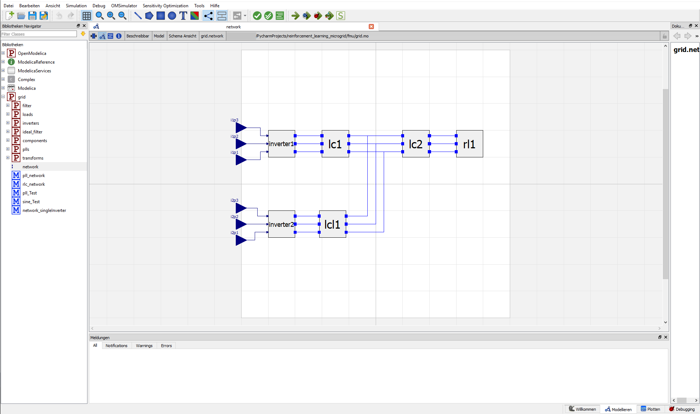
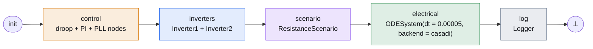
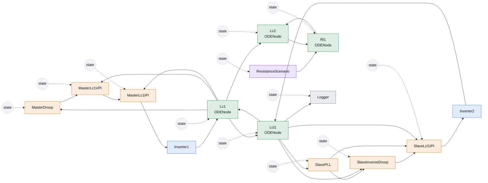
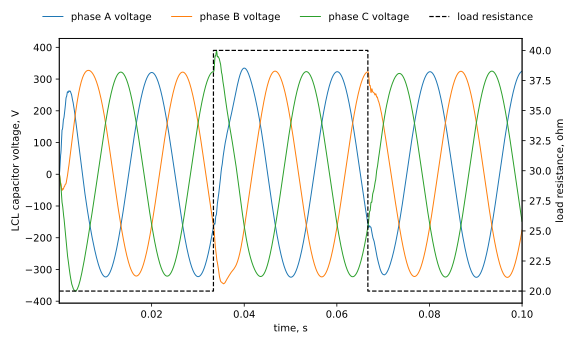

# Two Inverter Static Droop Control

This example simulates a native two-inverter network inspired by the
[OpenModelica two inverter static droop control example](https://upb-lea.github.io/openmodelica-microgrid-gym/parts/user_guide/examples/two_inverter_static_droop_control.html).
The original OpenModelica network is useful as the physical schematic: two
three-phase inverters feed a shared AC network and load through output filters.



The upper branch is the master inverter. It is voltage-forming: it tries to
shape the AC bus voltage and frequency. The lower branch is the slave inverter.
It synchronizes to the local voltage and injects controlled \(i_{abc}\)
according to the inverse droop law. In the original network image, the upper
branch uses an LC filter `lc1`; the lower branch uses an LCL filter `lcl1`; the
right side is the shared load network.

The runnable Regelum example lives in
`examples/two_inverter_static_droop/standalone.py`. It is a complete standalone
script with the controller, branch dynamics, PRS construction, and plotting in
one file, so it can be simulated without an OpenModelica/FMU runtime.

```bash
uv run python examples/two_inverter_static_droop/standalone.py
```

## Control Idea

The two-inverter network has to keep the AC bus in a useful operating region while both
inverters share the load.

The master inverter uses direct droop control. It measures instantaneous active
and reactive power at the bus:

\[
P = v_{abc}^{\mathsf{T}} i_{abc},
\qquad
Q \approx -\frac{1}{\sqrt{3}}
\begin{bmatrix}
v_b - v_c & v_c - v_a & v_a - v_b
\end{bmatrix}
i_{abc}.
\]

Then it shifts its frequency and voltage setpoint through filtered droop laws:

\[
f^\star = f_\mathrm{nom} + D_P(P),
\qquad
V^\star = V_\mathrm{nom} + D_Q(Q).
\]

Those setpoints go through \(v\)- and \(i\)-PI loops, and the result is a
three-phase modulation signal for the master inverter.

The slave inverter does the opposite direction. It runs a PLL on its local
capacitor voltage, estimates the local frequency, and uses inverse droop:

\[
i_d^\star \sim D_P^{-1}(f - f_\mathrm{nom}),
\qquad
i_q^\star \sim D_Q^{-1}(V - V_\mathrm{nom}).
\]

So the master forms the AC bus and the slave reacts to the AC bus. That is the
important control split: one inverter creates the voltage reference; the other
injects \(i_{abc}\) to help supply the load.

## ODE Regelum Model

The example keeps the same conceptual network but writes the electrical plant as
`rg.ODENode` equations wrapped into one `rg.ODESystem`. The controller is also
split into regular `rg.Node` blocks: droop, PI loops, PLL, inverse droop, and
\(i\)-control all keep their memory in `NodeState`.

First, the standalone script imports NumPy for the three-phase vectors and the
framework as `rg`:

```python
import numpy as np
import regelum as rg
```

The master starts with a droop node. It reads the `lc1.i_abc` and `lc1.v_abc`
signals from the ODE plant and publishes frequency, voltage setpoint, and AC
phase:

```python
class MasterDroop(rg.Node):
    class Inputs(rg.NodeInputs):
        lc1_i_abc: np.ndarray = rg.src(lambda: Lc1.State.i_abc)
        lc1_v_abc: np.ndarray = rg.src(lambda: Lc1.State.v_abc)

    class State(rg.NodeState):
        frequency_hz: float = rg.var(init=50.0)
        voltage_setpoint_v: float = rg.var(init=230.0 * math.sqrt(2.0))
        ac_phase_rad: float = rg.var(init=0.0)
        ac_phase_turns: float = rg.var(init=0.0)
        p_filter: float = rg.var(init=0.0)
        q_filter: float = rg.var(init=0.0)
```

The \(v\)- and \(i\)-PI loops are separate nodes. Their integrators and
anti-windup terms are explicit state variables:

```python
class MasterLc1VPI(rg.Node):
    class Inputs(rg.NodeInputs):
        lc1_v_abc: np.ndarray = rg.src(lambda: Lc1.State.v_abc)
        ac_phase_rad: float = rg.src(MasterDroop.State.ac_phase_rad)
        voltage_setpoint_v: float = rg.src(MasterDroop.State.voltage_setpoint_v)

    class State(rg.NodeState):
        i_ref_dq0: np.ndarray = rg.var(init=zero_abc)
        integral: np.ndarray = rg.var(init=zero_abc)
        windup: np.ndarray = rg.var(init=zero_abc)
```

The slave side is also explicit. The PLL estimates phase/frequency, inverse
droop computes the \(dq\) \(i\)-reference, and `SlaveLcl1IPI` produces slave
modulation:

```python
class SlavePLL(rg.Node):
    class State(rg.NodeState):
        cos_ac_phase: float = rg.var(init=1.0)
        sin_ac_phase: float = rg.var(init=0.0)
        frequency_hz: float = rg.var(init=50.0)
        ac_phase_rad: float = rg.var(init=0.0)
        ac_phase_turns: float = rg.var(init=0.0)
        integral: float = rg.var(init=0.0)
```

Two small inverter nodes convert controller modulation into phase voltages:

```python
class Inverter1(rg.Node):
    class Inputs(rg.NodeInputs):
        modulation: np.ndarray = rg.src(MasterLc1IPI.State.modulation)

    class State(rg.NodeState):
        v_abc: np.ndarray = rg.var(init=zero_abc)
```

The physical network is the continuous part. `Lc1`, `Lcl1`, `Lc2`, and `Rl1`
are `rg.ODENode` classes. Their states are normalized: each node stores only
its own dynamic variables. Neighboring branches are read through `rg.src`
declarations in `dstate(...)`.
Thus `Lc1.State` and `Lc2.State` contain `v_abc` and `i_abc`, `Lcl1.State`
contains `v_abc`, `inv_i_abc`, and `bus_i_abc`, and `Rl1.State` contains
`i_abc`. Regelum traces these arrays as CasADi `MX` vectors inside
`dstate(...)`. For example, the master LC filter is ordinary vector algebra:

```python
class Lc1(rg.ODENode):
    class State(rg.NodeState):
        v_abc: np.ndarray = rg.var(init=zero_abc)
        i_abc: np.ndarray = rg.var(init=zero_abc)

    def dstate(
        self,
        state: State,
        inverter_v_abc: np.ndarray = rg.src(Inverter1.State.v_abc),
        lcl1_bus_i_abc: np.ndarray = rg.src(lambda: Lcl1.State.bus_i_abc),
        lc2_i_abc: np.ndarray = rg.src(lambda: Lc2.State.i_abc),
    ) -> State:
        return self.State(
            v_abc=(state.i_abc + lcl1_bus_i_abc - lc2_i_abc)
            / self.capacitance,
            i_abc=(inverter_v_abc - state.v_abc) / self.inductance,
        )
```

The LCL slave branch is also an ODE node. Its `v_abc` signal is what the plot
records:

```python
class Lcl1(rg.ODENode):
    class State(rg.NodeState):
        v_abc: np.ndarray = rg.var(init=zero_abc)
        inv_i_abc: np.ndarray = rg.var(init=zero_abc)
        bus_i_abc: np.ndarray = rg.var(init=zero_abc)
```

`Lc2` and `Rl1` complete the load-side network. The load resistance is
not embedded as symbolic branching inside the ODE; it is a normal discrete
scenario node. For a 2000-step run, the first third uses `R`, the second third
uses `2R`, and the final third returns to `R`:

```python
class ResistanceScenario(rg.Node):
    class Inputs(rg.NodeInputs):
        tick: int = rg.src(rg.Clock.tick)

    class State(rg.NodeState):
        resistance: float = rg.var(init=20.0)

    def update(self, inputs: Inputs) -> State:
        if inputs.tick < self.first_switch_tick:
            resistance = self.base_resistance
        elif inputs.tick < self.second_switch_tick:
            resistance = 2.0 * self.base_resistance
        else:
            resistance = self.base_resistance
        return self.State(resistance=resistance)


class Rl1(rg.ODENode):
    class Inputs(rg.NodeInputs):
        lc2_v_abc: np.ndarray = rg.src(Lc2.State.v_abc)
        resistance: float = rg.src(ResistanceScenario.State.resistance)

    class State(rg.NodeState):
        i_abc: np.ndarray = rg.var(init=zero_abc)

    def dstate(self, inputs: Inputs, state: State) -> State:
        return self.State(
            i_abc=(inputs.lc2_v_abc - inputs.resistance * state.i_abc) / self.inductance,
        )
```

## Build The System

The PRS splits one simulation tick into four phases. The continuous electrical
network is one `rg.ODESystem`, so Regelum integrates the coupled ODE nodes
together on the base electrical step.

```python
def build_system(*, steps: int = 2000) -> rg.PhasedReactiveSystem:
    master_droop = MasterDroop()
    master_lc1_v_pi = MasterLc1VPI()
    master_lc1_i_pi = MasterLc1IPI()
    slave_pll = SlavePLL()
    slave_inverse_droop = SlaveInverseDroop()
    slave_lcl1_i_pi = SlaveLcl1IPI()
    inverter1 = Inverter1()
    inverter2 = Inverter2()
    resistance = ResistanceScenario(
        first_switch_tick=steps // 3,
        second_switch_tick=2 * steps // 3,
    )
    lc1 = Lc1()
    lcl1 = Lcl1()
    lc2 = Lc2()
    rl1 = Rl1()
    electrical = rg.ODESystem(
        nodes=(lc1, lcl1, lc2, rl1),
        dt="0.00005",
        backend="casadi",
        method="cvodes",
        options={"abstol": 1e-9, "reltol": 1e-8},
    )
    logger = Logger()

    return rg.PhasedReactiveSystem(
        phases=[
            rg.Phase(
                "control",
                nodes=(
                    master_droop,
                    master_lc1_v_pi,
                    master_lc1_i_pi,
                    slave_pll,
                    slave_inverse_droop,
                    slave_lcl1_i_pi,
                ),
                transitions=(rg.Goto("inverters"),),
                is_initial=True,
            ),
            rg.Phase("inverters", nodes=(inverter1, inverter2), transitions=(rg.Goto("scenario"),)),
            rg.Phase("scenario", nodes=(resistance,), transitions=(rg.Goto("electrical"),)),
            rg.Phase("electrical", nodes=(electrical,), transitions=(rg.Goto("log"),)),
            rg.Phase("log", nodes=(logger,), transitions=(rg.Goto(rg.terminate),)),
        ],
    )
```

This order is deliberate. The control phase resolves the controller DAG from
measurements to modulation, the inverter nodes compute phase voltages, the
scenario node publishes the sampled load resistance, `electrical` integrates the
continuous LC/LCL/load ODEs, and finally the logger records the LCL capacitor
voltage plus the active resistance.

## Phase Graph


```mermaid
flowchart LR
    init([init]) --> control["control<br/>droop + PI + PLL nodes"]
    control --> inverters["inverters<br/>Inverter1 + Inverter2"]
    inverters --> scenario["scenario<br/>ResistanceScenario"]
    scenario --> electrical["electrical<br/>ODESystem(dt = 0.00005, backend = casadi)"]
    electrical --> log["log<br/>Logger"]
    log --> done([⊥])

    classDef control fill:#d9770622,stroke:#d97706,color:#111318
    classDef inverters fill:#2f6fed22,stroke:#2f6fed,color:#111318
    classDef scenario fill:#7c3aed22,stroke:#7c3aed,color:#111318
    classDef electrical fill:#15803d22,stroke:#15803d,color:#111318
    classDef log fill:#64748b22,stroke:#64748b,color:#111318
    class control control
    class inverters inverters
    class scenario scenario
    class electrical electrical
    class log log
```

## Node Graph

Node colors follow phase colors. Dashed self-state arrows show state carried
from the previous tick.


```mermaid
flowchart LR
    masterDroop["MasterDroop"] --> masterLc1VPI["MasterLc1VPI"]
    masterLc1VPI --> masterLc1IPI["MasterLc1IPI"]
    masterLc1IPI --> inv1["Inverter1"]

    slavePLL["SlavePLL"] --> slaveInverseDroop["SlaveInverseDroop"]
    slaveInverseDroop --> slaveLcl1IPI["SlaveLcl1IPI"]
    slavePLL --> slaveLcl1IPI
    slaveLcl1IPI --> inv2["Inverter2"]
    scenario["ResistanceScenario"] --> rl1["Rl1<br/>ODENode"]

    inv1 --> lc1["Lc1<br/>ODENode"]
    inv2 --> lcl1["Lcl1<br/>ODENode"]
    lcl1 --> lc1
    lc1 --> lcl1
    lc1 --> lc2["Lc2<br/>ODENode"]
    lc2 --> rl1
    rl1 --> lc2
    lc1 --> masterDroop
    lc1 --> masterLc1VPI
    lc1 --> masterLc1IPI
    lcl1 --> slavePLL
    lcl1 --> slaveInverseDroop
    lcl1 --> slaveLcl1IPI
    lcl1 --> logger["Logger"]

    master_droop_state(("state")) -.-> masterDroop
    master_lc1_v_pi_state(("state")) -.-> masterLc1VPI
    master_lc1_i_pi_state(("state")) -.-> masterLc1IPI
    slave_pll_state(("state")) -.-> slavePLL
    slave_inverse_state(("state")) -.-> slaveInverseDroop
    slave_lcl1_i_pi_state(("state")) -.-> slaveLcl1IPI
    lc1_state(("state")) -.-> lc1
    lcl1_state(("state")) -.-> lcl1
    lc2_state(("state")) -.-> lc2
    rl1_state(("state")) -.-> rl1
    logger_state(("state")) -.-> logger
    scenario_state(("state")) -.-> scenario

    classDef control fill:#d9770622,stroke:#d97706,color:#111318
    classDef inverters fill:#2f6fed22,stroke:#2f6fed,color:#111318
    classDef scenarioPhase fill:#7c3aed22,stroke:#7c3aed,color:#111318
    classDef electrical fill:#15803d22,stroke:#15803d,color:#111318
    classDef log fill:#64748b22,stroke:#64748b,color:#111318
    classDef state fill:#94a3b822,stroke:#94a3b8,stroke-dasharray:3 3,color:#111318
    class masterDroop,masterLc1VPI,masterLc1IPI,slavePLL,slaveInverseDroop,slaveLcl1IPI control
    class inv1,inv2 inverters
    class scenario scenarioPhase
    class lc1,lcl1,lc2,rl1 electrical
    class logger log
    class master_droop_state,master_lc1_v_pi_state,master_lc1_i_pi_state,slave_pll_state,slave_inverse_state,slave_lcl1_i_pi_state,scenario_state,lc1_state,lcl1_state,lc2_state,rl1_state,logger_state state
```

## Phase Table

| Phase | Nodes | Role |
|---|---|---|
| <span class="phase-label phase-label--control">control</span> | `MasterDroop`, `MasterLc1VPI`, `MasterLc1IPI`, `SlavePLL`, `SlaveInverseDroop`, `SlaveLcl1IPI` | Computes master voltage-forming and slave modulation as a DAG of stateful nodes. |
| <span class="phase-label phase-label--branches">inverters</span> | `Inverter1`, `Inverter2` | Converts modulation into three-phase inverter voltages. |
| scenario | `ResistanceScenario` | Publishes the sampled load resistance: `R`, then `2R`, then `R`. |
| <span class="phase-label phase-label--bus">electrical</span> | `ODESystem(Lc1, Lcl1, Lc2, Rl1)` | Integrates the coupled electrical differential equations. |
| <span class="phase-label phase-label--log">log</span> | `Logger` | Stores the LCL capacitor voltages and resistance for plotting. |

## Node Table

| Node | State | Reads |
|---|---|---|
| <span class="node-label phase-label--control">MasterDroop</span> | frequency, voltage setpoint, AC phase, droop filter states | `lc1.v_abc`, `lc1.i_abc` |
| <span class="node-label phase-label--control">MasterLc1VPI</span> | `i_ref_dq0`, PI integral, windup | `lc1.v_abc` and `MasterDroop` AC phase/setpoint |
| <span class="node-label phase-label--control">MasterLc1IPI</span> | master modulation, PI integral, windup | `lc1.i_abc` and `MasterLc1VPI.i_ref_dq0` |
| <span class="node-label phase-label--control">SlavePLL</span> | AC phase estimate, frequency estimate, PLL integral | `lcl1.v_abc` |
| <span class="node-label phase-label--control">SlaveInverseDroop</span> | `i_ref_dq0` and inverse-droop filter states | `SlavePLL` frequency and `lcl1.v_abc` |
| <span class="node-label phase-label--control">SlaveLcl1IPI</span> | slave modulation, PI integral, windup | `lcl1.inv_i_abc`, `SlavePLL` AC phase, `SlaveInverseDroop.i_ref_dq0` |
| <span class="node-label phase-label--branches">Inverter1</span> | `v_abc` | Master modulation |
| <span class="node-label phase-label--branches">Inverter2</span> | `v_abc` | Slave modulation |
| `ResistanceScenario` | `resistance` | `rg.Clock.tick` |
| <span class="node-label phase-label--bus">Lc1</span> | `v_abc`, `i_abc` | `Inverter1.v_abc`, `Lcl1.bus_i_abc`, `Lc2.i_abc` |
| <span class="node-label phase-label--bus">Lcl1</span> | `v_abc`, `inv_i_abc`, `bus_i_abc` | `Inverter2.v_abc` and `bus_v_abc` |
| <span class="node-label phase-label--bus">Lc2</span> | `v_abc`, `i_abc` | `bus_v_abc`, `Rl1.i_abc` |
| <span class="node-label phase-label--bus">Rl1</span> | `i_abc` | `Lc2.v_abc` and `ResistanceScenario.resistance` |
| <span class="node-label phase-label--log">Logger</span> | `samples` | Built-in `rg.Clock.time`, `Lcl1.v_abc`, and resistance |

## Simulation Result

The documentation plot is generated by:

```bash
uv run python examples/two_inverter_static_droop/standalone.py \
  --steps 2000
```

The plotted signal combines the three-phase capacitor voltage of the slave LCL
filter and the sampled load resistance. The resistance scenario occupies equal
thirds of the run: nominal resistance, doubled resistance, and nominal
resistance again.



The full standalone listing below is the concrete executable example: helper
math, controllers, Regelum node definitions, PRS construction, simulation, and
plotting in one file.

??? example "Standalone Python listing"

    ```python
    --8<-- "examples/two_inverter_static_droop/standalone.py"
    ```
