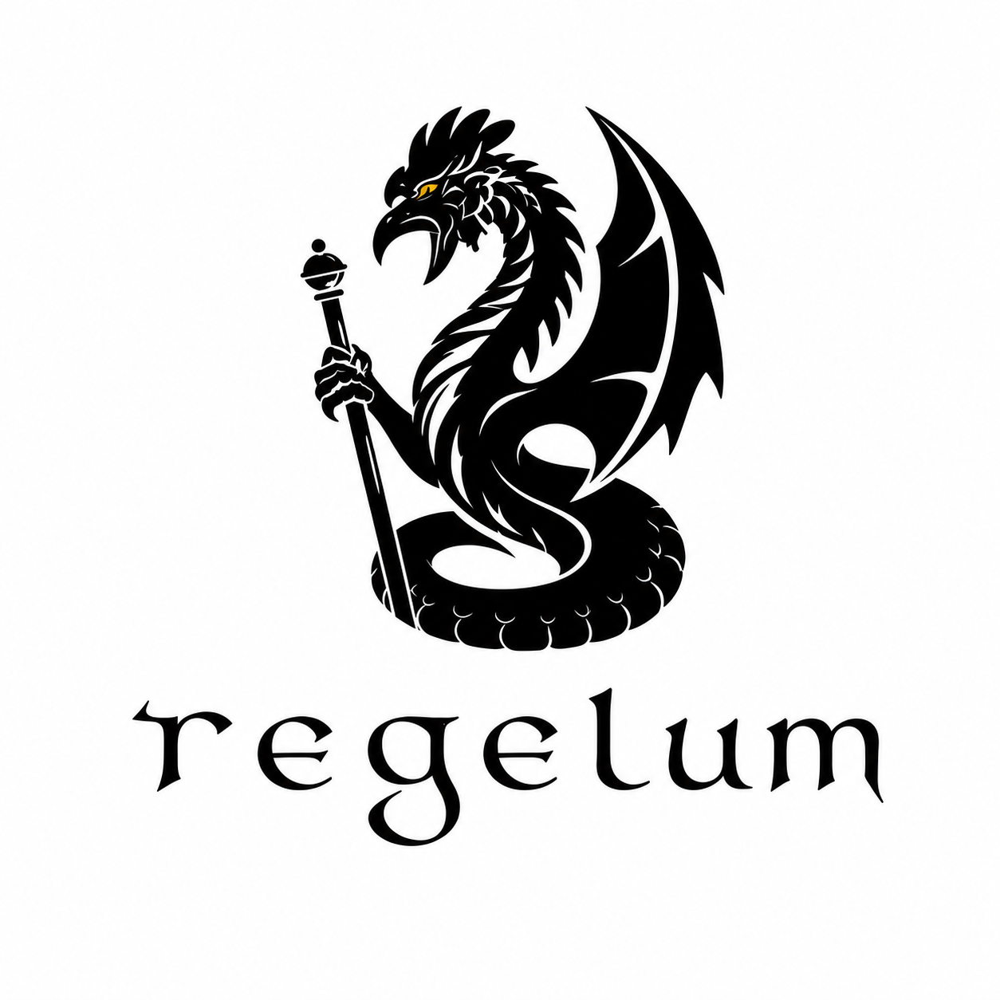

---
hide:
  - toc
---

<style>
.md-content .md-typeset h1 { display: none; }
</style>

<p class="hero-logo">
  
</p>

<p>
  <a href="https://github.com/aidagroup/regelum">
    
  </a>
  
  
  
</p>

`regelum` is a framework for modeling **Phased Reactive Systems**:
systems that execute one tick at a time, activate different groups of nodes in
different phases, and move between phases with explicit transitions.

The framework is built around four surface ideas:

- nodes declare typed inputs and outputs;
- phases define which node instances are active together;
- transitions decide how one phase hands control to the next;
- continuous nodes can be grouped into ODE systems and integrated inside a
  phase;
- compilation resolves links, schedules nodes, and catches mistakes early.

Install from PyPI with `uv`:

```bash
uv add regelum
```

```python
import regelum as rg


class TemperatureSensor(rg.Node):
    class Outputs(rg.NodeOutputs):
        temperature: float = rg.Output(initial=19.0)

    def run(self) -> Outputs:
        return self.Outputs(temperature=21.5)


class HeaterController(rg.Node):
    class Inputs(rg.NodeInputs):
        temperature: float = rg.Input(
            source=TemperatureSensor.Outputs.temperature,
        )

    class Outputs(rg.NodeOutputs):
        heater_on: bool

    def run(self, inputs: Inputs) -> Outputs:
        return self.Outputs(heater_on=inputs.temperature < 22.0)


sensor = TemperatureSensor(name="room_sensor")
controller = HeaterController(name="heater_controller")

system = rg.PhasedReactiveSystem(
    phases=[
        rg.Phase(
            "control",
            nodes=(sensor, controller),
            transitions=(rg.Goto(rg.terminate),),
            is_initial=True,
        ),
    ],
)
```

## Local development

Set up the repository, install hooks, and run the full local gate:

```bash
uv sync --all-groups
uv run prek install --hook-type pre-commit --hook-type pre-push
uv run prek run --all-files
```

The `pre-push` hook runs `pytest`, so a normal `git push` exercises the test
suite automatically.

## Local docs

```bash
uv run --group docs mkdocs serve \
  --watch docs \
  --watch mkdocs.yml \
  --watch src/regelum \
  --watch README.md
```

Build the static site:

```bash
uv run --group docs mkdocs build
```
