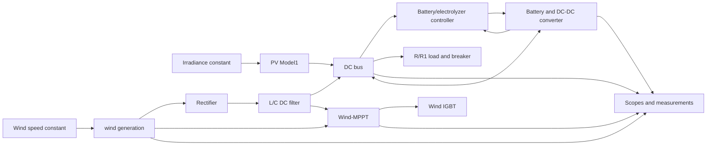

# PV wind battery DC microgrid structure

Source model: `PV_wind_bat_DC_Microgrid.slx`

Extracted thumbnail: `PV_wind_bat_DC_Microgrid_thumbnail.png`

## Model metadata

- Saved as MATLAB/Simulink R2013a model.
- Stop time: `3`.
- Solver: `ode23tb`.
- Physical modeling product marker: `Power_System_Blocks`.
- Top-level model has 48 blocks and 43 explicit top-level lines.
- Total parsed systems: 18.

## Required Simulink libraries seen in the model

- `powerlib`: Specialized Power Systems / old SimPowerSystems blocks.
- `powerlib_extras`: measurement and discrete control helper blocks.
- `electricdrivelib`: battery block.
- `dsparch4`: analog filter design block.
- Standard Simulink blocks: gains, sums, products, scopes, mux/demux, memory, unit delay, saturation.

## Main top-level subsystems

- `PV Model1`: photovoltaic model with P&O MPPT logic, PV module equation block, controlled voltage source, current measurement, and PV electrical ports.
- `wind generation`: wind turbine, two-mass drive train, PMSG, pitch angle controller, and three-phase measurement blocks.
- `Wind-MPPT`: wind-side MPPT and current controller producing torque/current references and IGBT gate signal.
- `Battery and DC-DC converter`: Ni-MH battery, bidirectional DC-DC converter with two IGBTs, two diodes, inductor, breaker, current/SOC outputs.
- `Battery/electrolyzer controller`: PI/relay/unit-delay control producing switching signals for the battery converter.
- Top-level DC bus/electrical interface: rectifier, DC capacitors, R/R1 load branches, breaker, ground, current/voltage measurements, scopes, and `powergui`.

## Simplified top-level architecture

## PV subsystem

- Inputs: irradiance.
- Electrical ports: `PV+`, `PV-`.
- Uses `powerlib/Electrical Sources/Controlled Voltage Source`.
- Has a `P & O` subsystem with sampled perturb-and-observe MPPT:
  - sample time: `0.002`;
  - step constant: `0.05`;
  - initial/reference constant: `655`.
- Has a `PV module (I)` subsystem:
  - algebraic constraint solves current/voltage relation;
  - parameters are symbolic workspace variables such as `G`, `Ns`, `Rs`, `Rp`, `ns`.

## Wind subsystem

- Input: wind speed `Ws`.
- Main components:
  - wind turbine model;
  - pitch angle controller;
  - two-mass drive train;
  - PMSG from `powerlib/Machines/Permanent Magnet Synchronous Machine`;
  - three-phase voltage/current measurement blocks.
- Constants visible:
  - `8500`;
  - `152.89`.
- PMSG visible parameters:
  - stator resistance: `0.425`;
  - inductance: `8.5e-3`;
  - preset model: `No`.

## Battery and converter subsystem

- Battery block: `electricdrivelib/Extra Sources/Battery`.
- Label: `200 volts, 6.5 Ah Ni-MH battery`.
- Converter components:
  - `Q1`, `Q2`: IGBT blocks;
  - `Diode`, `Diode1`;
  - `L3`: series RLC branch configured as inductor, `5e-3 H`;
  - breaker;
  - current measurement `IL6`.
- Outputs:
  - `Ibat`;
  - `SOC`;
  - `Bp`.

## Notes

This extraction does not execute the model. It reconstructs the model composition from the `.slx` XML container. Exact numeric simulation behavior still depends on MATLAB workspace variables and old Specialized Power Systems block implementations.
